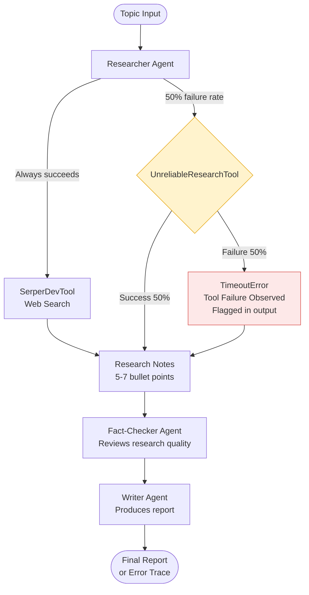
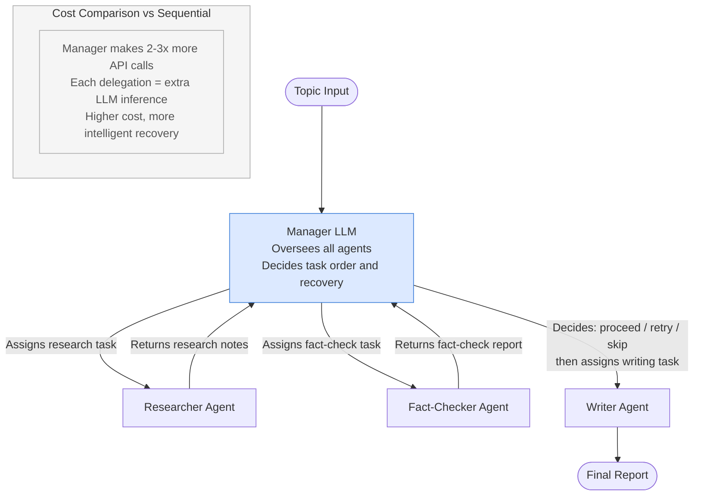
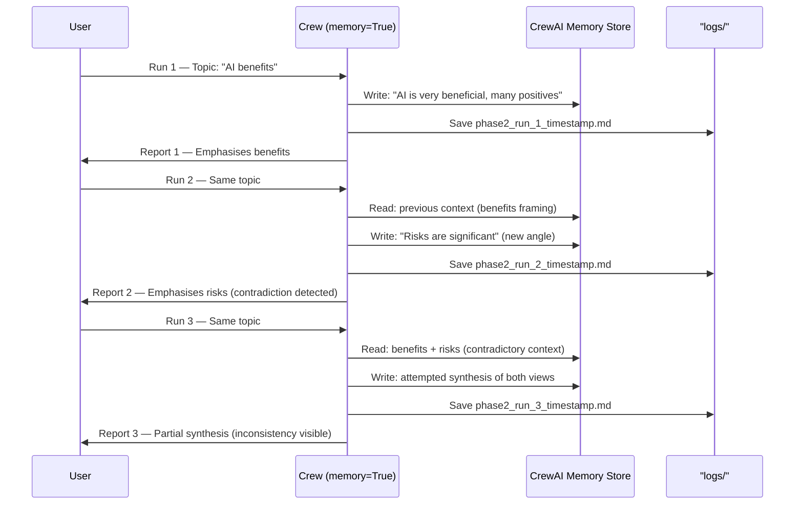
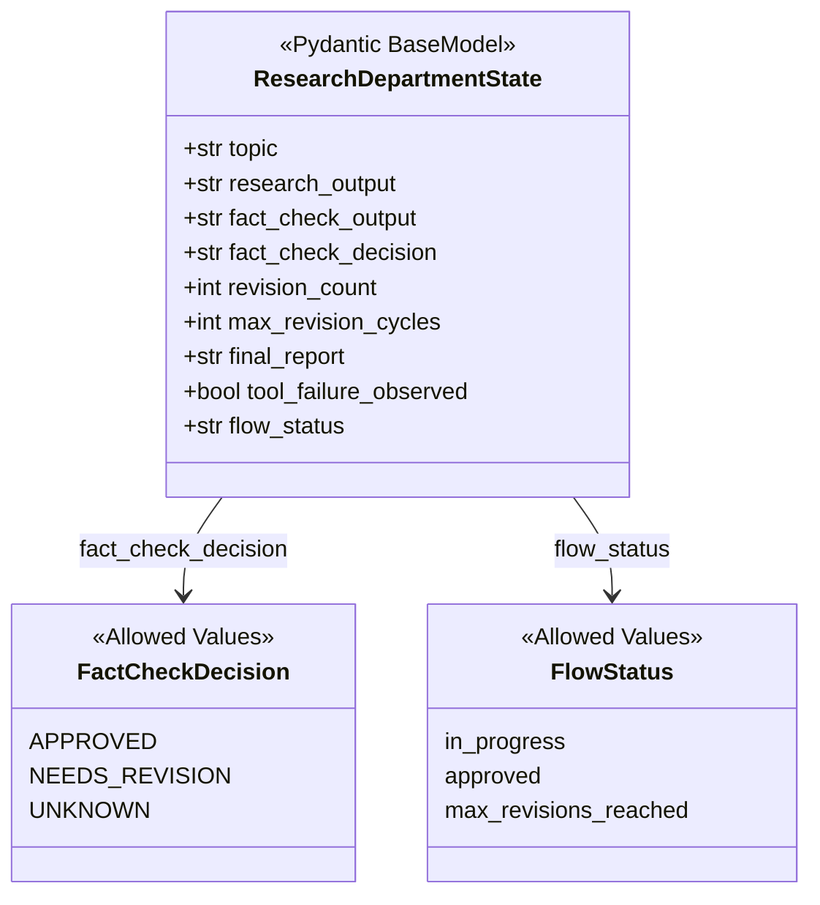
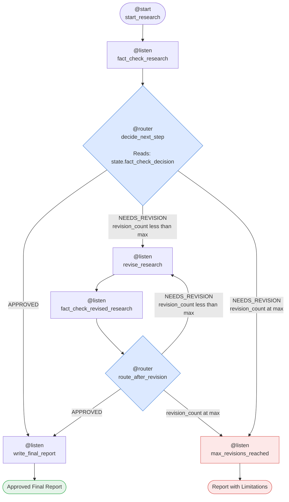
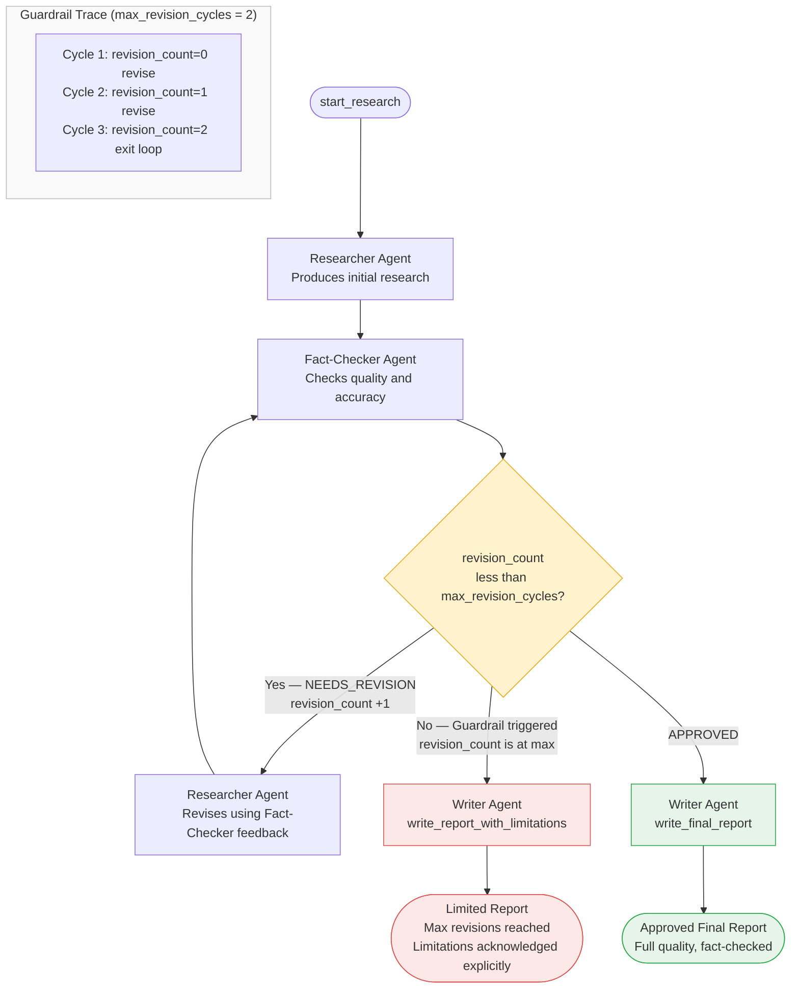

# Autonomous Research Department System - Design Document

---

## 1. System Architecture

The Autonomous Research Department is a multi-agent orchestration system that demonstrates how CrewAI manages coordinated agent workflows under real-world constraints: tool failures, contradictory data, and quality assurance loops. The system progresses through three verification phases—from basic orchestration to event-driven state management—to validate production-readiness of agent coordination strategies.

At its core, the system deploys three specialized agents (Researcher, Fact-Checker, Writer) that collaborate on a research topic. Each phase adds sophistication: Phase 1 tests orchestration strategies under failure; Phase 2 validates memory and configuration management; Phase 3 implements dynamic revision workflows with loop guardrails.

### Data Flow:

1. **Input**: Topic provided by user → passed to agents via structured task inputs
2. **Research Phase**: Researcher agent uses SerperDevTool + UnreliableResearchTool → produces research notes (may fail 50% of the time)
3. **Fact-Check Phase**: Fact-Checker reviews research notes → produces decision (APPROVED or NEEDS_REVISION) + structured feedback
4. **Routing Decision** (Phase 3 only): Router evaluates fact-check decision → branches to approval path, revision loop, or guardrail exit
5. **Revision Loop** (Phase 3 only): If NEEDS_REVISION and revisions < max, Researcher revises based on feedback → returns to Fact-Check (creates loop)
6. **Writing Phase**: Writer produces final report from approved research OR acknowledged limitations (if guardrail triggered)
7. **Output**: Final report + execution logs + structured state saved to `logs/` directory

---

## 2. Tech Stack

| Layer                         | Technology                                           | Purpose                                             | Why Chosen                                                                        |
| ----------------------------- | ---------------------------------------------------- | --------------------------------------------------- | --------------------------------------------------------------------------------- |
| **LLM**                 | Google Gemini 2.5 Flash Lite                         | Core reasoning for all agents                       | Cost-effective for development, fast inference, supports agent coordination       |
| **Agent Framework**     | CrewAI                                               | Multi-agent orchestration and task coordination     | Purpose-built for agent workflows, supports memory, flows, hierarchical execution |
| **Orchestration Model** | CrewAI Flow + @decorators (@start, @listen, @router) | Event-driven workflow control                       | Enables dynamic routing, conditional branching, and loop management               |
| **State Management**    | Pydantic BaseModel                                   | Type-safe structured state across Flow steps        | Validation, immutability guarantees, cleaner state passing than raw dictionaries  |
| **Configuration**       | External YAML files (agents.yaml, tasks.yaml)        | Decoupled agent/task definitions from code          | Enables non-engineers to modify workflows, supports versioning and A/B testing    |
| **Web Search Tool**     | SerperDevTool (CrewAI built-in)                      | Real-time web information retrieval                 | Official integration with CrewAI, no additional setup required                    |
| **Failure Injection**   | Custom UnreliableResearchTool (Python)               | Simulates 50% tool failure rate                     | Validates error handling and agent resilience under realistic tool degradation    |
| **Logging & Artifacts** | Markdown files + Flow.plot()                         | Execution traces, final reports, flow visualization | Human-readable logs, HTML flow diagrams for debugging and documentation           |
| **Environment**         | Python 3.10+, dotenv                                 | Secure API key management, runtime configuration    | Standard Python practices, prevents hardcoded secrets                             |

---

## 3. Verification Pipeline - Step by Step

---

### **Phase 1: Orchestration & Failure Handling**

#### Step 1: Sequential Execution with Failures

**Purpose:**
Establish baseline behavior when a single orchestration strategy (sequential) encounters tool failures. Observe whether agents retry, fail gracefully, or propagate errors upstream.

**Example:**

```
Input: Topic "AI in Software Development"
Researcher executes → SerperDevTool succeeds, UnreliableResearchTool fails 50% of the time
→ If fails: Error propagates? Agent logs it? Execution halts?
Output: Research notes OR error trace
```

**Key Design Decisions:**

- **Decision:** Use 50% failure rate for UnreliableResearchTool
- **Options Considered:** 100% failure (obvious), 10% (hard to detect), 50% (forces real error handling), random timing, cascading failures
- **Why This Decision:** 50% failure rate makes tool unreliability inevitable within a single execution yet observable—high enough to trigger consistently, low enough to allow some successful runs. This tests whether the crew can handle intermittent tool failures gracefully without being designed specifically to expect them.
- **Decision:** Use Process.sequential for Phase 1 baseline
- **Options Considered:** Hierarchical workflow, custom orchestration, task dependencies, dynamic routing
- **Why This Decision:** Sequential is the simplest orchestration model; it establishes a control baseline. If sequential execution fails under tool failure, we have a concrete problem to solve. If it handles failures well, we've validated that failure is not an orchestration issue.



---

#### Step 2: Hierarchical Execution with Failures

**Purpose:**
Evaluate whether adding a Manager LLM (hierarchical orchestration) improves resilience to tool failures. Compare cost, latency, and decision quality vs. sequential.

**Example:**

```
Input: Same topic
Manager LLM oversees Researcher, Fact-Checker, Writer → decides task order
If Researcher tool fails, does Manager retry? Reallocate to another agent? Skip task?
Output: Final report (from Manager decision) + cost metrics
```

**Key Design Decisions:**

- **Decision:** Implement hierarchical workflow with Manager agent supervising three specialists
- **Options Considered:** Add retry logic at crew level, add human-in-the-loop gate, add dynamic agent selection, implement task-level fallbacks
- **Why This Decision:** Hierarchical workflow tests whether adding a decision-making layer improves failure handling. The Manager LLM sees the full context and can make intelligent decisions about how to proceed when tools fail—but this adds LLM cost (multiple calls to Manager instead of agents deciding directly). The comparison with Phase 1 reveals whether that cost is justified.
- **Decision:** Compare cost and latency metrics between sequential and hierarchical
- **Options Considered:** Skip metrics (not useful), only log on errors, full telemetry per task, sample-based metrics
- **Why This Decision:** The problem statement asks explicitly: "Why is Hierarchical processing significantly more expensive?" We must measure cost (token count, API calls, latency) to answer this question. This validates whether hierarchical orchestration is worth the cost in production.



---

### **Phase 2: YAML Configuration & Memory Behavior**

#### Step 3: External Configuration Loading

**Purpose:**
Decouple agent and task definitions from Python code. Validate that YAML-driven configuration enables runtime flexibility and supports multiple crew configurations without code changes.

**Example:**

```
agents.yaml defines: Researcher (role, goal, backstory), Fact-Checker, Writer
tasks.yaml defines: research_task, fact_check_task, writing_task (descriptions, expected outputs, dependencies)
Python code loads → Agent/Task objects created dynamically
→ Change task descriptions in YAML without code deploy
```

**Key Design Decisions:**

- **Decision:** Tools assigned in Python, metadata in YAML (hybrid approach)
- **Options Considered:** All YAML (impossible—YAML can't instantiate Python objects), all Python (defeats configuration decoupling), hybrid (tools in code, metadata in YAML)
- **Why This Decision:** YAML cannot directly instantiate Python tool objects like `SerperDevTool()` or `UnreliableResearchTool()`. The hybrid approach separates concerns: non-engineers modify YAML (task descriptions, agent roles), engineers manage tools in code. This balances flexibility with practical constraints.
- **Decision:** Use `@format()` string substitution for dynamic input injection into task descriptions
- **Options Considered:** String templating libraries, f-strings in YAML (not valid YAML), environment variables, task-level parameters
- **Why This Decision:** `description.format(**inputs)` keeps YAML simple while allowing dynamic topics. The topic parameter flows through cleanly: user input → function argument → format string → task description. This maintains single-responsibility (YAML = static metadata, Python = dynamic logic).

---

#### Step 4: Memory Behavior Across Executions

**Purpose:**
Enable CrewAI's internal memory system (`memory=True`) and run the same crew multiple times. Observe whether agents remember previous runs and whether contradictions arise from different memory states.

**Example:**

```
Run 1: Topic "AI benefits" → memory stores observations
Run 2: Same topic → crew accesses Run 1 memory → does it contradict Run 1? agree? provide new angles?
Run 3: Compare Run 1 vs Run 3 outputs → are they consistent or contradictory?
Problem statement: "Introduce a contradiction" → this tests whether memory handles contradictions gracefully
```

**Key Design Decisions:**

- **Decision:** Enable `memory=True` in Crew configuration and run multiple times on same topic
- **Options Considered:** Disable memory (no cross-run context), enable memory (accept contradictions), implement conflict resolution, use external knowledge base
- **Why This Decision:** CrewAI's memory system is a black box here—we're validating its real-world behavior. By running multiple times on the same topic with memory enabled, we observe: Do agents hallucinate from corrupted memory? Do they synthesize new insights? Do contradictions surface? This is a validation step, not a production optimization.
- **Decision:** Save timestamped logs for each execution to enable comparison
- **Options Considered:** Single log (can't compare runs), database (overkill), markdown files per run (lightweight)
- **Why This Decision:** Markdown files are human-readable, version-controllable, and sufficient for Phase 2's memory validation. Each timestamped log allows engineers to manually compare outputs across runs and detect contradictions—this is intentional: we want to see failure modes and edge cases.



---

### **Phase 3: Event-Driven Flows with Revision Guardrails**

#### Step 5: Structured State Management with Pydantic

**Purpose:**
Replace unstructured text passing between tasks with a Pydantic state model. Validate that structured state prevents data loss, enables clear state transitions, and supports complex branching logic.

**Example:**

```
ResearchDepartmentState:
  - research_output: str
  - fact_check_output: str
  - fact_check_decision: "APPROVED" | "NEEDS_REVISION" | "UNKNOWN"
  - revision_count: int (guardrail counter)
  
Each Flow step updates state → next step reads clean, validated data
Router makes branching decisions based on fact_check_decision, not regex parsing of text
```

**Key Design Decisions:**

- **Decision:** Use Pydantic BaseModel for state instead of nested dictionaries or raw strings
- **Options Considered:** Raw dicts (no validation), dataclasses (no built-in validation), Pydantic (full validation + serialization)
- **Why This Decision:** Pydantic provides runtime validation (e.g., `revision_count` must be int), type hints for IDE support, and clean error messages if state is corrupted. In Phase 2, we parsed text for decisions (`"DECISION: APPROVED"` regex). In Phase 3, `state.fact_check_decision` is explicitly typed and guaranteed valid. This reduces debugging time and prevents parsing bugs.
- **Decision:** Store all intermediate outputs (research_output, fact_check_output, final_report) in state
- **Options Considered:** Only store final report (lose context), store in external database (complex), store in state (simple, auditable)
- **Why This Decision:** Storing all outputs enables two things: (1) Writer agent can see full context to reason about limitations, and (2) logs can reconstruct the entire decision path for audit. This is critical for production systems where engineers must understand why a revision loop occurred or why a report has limitations.



---

#### Step 6: Event-Driven Routing with @router Decorator

**Purpose:**
Implement conditional branching based on agent decisions. Replace fixed sequential workflow with dynamic paths: approval path, revision loop, or guardrail exit.

**Example:**

```
Flow:
  1. Researcher produces research
  2. Fact-Checker decides: APPROVED or NEEDS_REVISION
  3. Router checks decision:
     - If APPROVED → jump to write_final_report
     - If NEEDS_REVISION and revision_count < 2 → revise_research (loop)
     - If NEEDS_REVISION and revision_count >= 2 → write_report_with_limitations (guardrail)

Input: Same topic
Output: Depends on router path (approved report, limited report, or after N revision cycles)
```

**Key Design Decisions:**

- **Decision:** Use @router decorator to make branching decisions based on agent output parsed into state
- **Options Considered:** Hardcode branches in task sequence, use if-statements in task descriptions (unreliable), implement custom orchestration, use CrewAI Flows @router
- **Why This Decision:** @router enables clean, auditable branching logic. The condition (fact_check_decision) is machine-readable state, not fuzzy text parsing. This makes the workflow deterministic, testable, and easy to modify. Hardcoding branches would require code changes for each new decision point; @router is declarative and extensible.
- **Decision:** Parse agent output for decision keywords ("DECISION: APPROVED" / "DECISION: NEEDS_REVISION") in task expected_output
- **Options Considered:** Structured output from agent (JSON), free-form text with keyword search, custom parsers, agent confirmation prompts
- **Why This Decision:** Asking the agent to return an explicit decision line is pragmatic. The agent already knows it must decide approve/revise; making that decision explicit in the output ensures the parser can extract it reliably. This is simpler than forcing JSON structure (which agents sometimes refuse) or trying to extract intent from freeform text.



---

#### Step 7: Revision Loop with Guardrail Protection

**Purpose:**
Implement an iterative improvement workflow where Researcher revises based on Fact-Checker feedback. Add a guardrail (max_revision_cycles) to prevent infinite loops and force convergence.

**Example:**

```
Cycle 1: Researcher → Fact-Check → Router: NEEDS_REVISION, revision_count=0 < max=2 → revise
Cycle 2: Revised Researcher → Fact-Check → Router: NEEDS_REVISION, revision_count=1 < max=2 → revise
Cycle 3: Re-revised Researcher → Fact-Check → Router: NEEDS_REVISION, revision_count=2 >= max=2 → max_revisions_reached → write_report_with_limitations

Output: Final report acknowledges: "Max revision cycles reached. Quality may be limited."
```

**Key Design Decisions:**

- **Decision:** Implement revision_count guardrail with max_revision_cycles=2
- **Options Considered:** No guardrail (risk infinite loop), max=1 (too restrictive), max=3+ (costs more), max=2 (balanced), dynamic max based on topic complexity
- **Why This Decision:** max_revision_cycles=2 provides one retry opportunity. With Phase 3's goal of "demonstrating failure handling and state management," two cycles allow the researcher to address feedback once, then forces Writer to complete the report. Infinite loops are unacceptable in production; max_revision_cycles is an explicit safety valve. This trades perfect quality for guaranteed termination.
- **Decision:** If max revisions reached, Writer produces report with explicit limitations statement
- **Options Considered:** Fail the workflow, return incomplete report, force approval, hide limitations, acknowledge limitations explicitly
- **Why This Decision:** Returning a report with limitations is honest and practical. The student/user sees: "Research is incomplete because Fact-Checker and Researcher could not converge. Here's the best available report." This is better than failing silently (production downtime) or hiding the limitation (user thinks report is approved). It demonstrates graceful degradation.
- **Decision:** Revision loop triggered by @listen(revise_research) → fact_check_revised_research → route_after_revision → loop back or exit
- **Options Considered:** Single revision step, nested loops in Python, async retry logic, external workflow engine
- **Why This Decision:** CrewAI Flow's event chain (@listen → @router → @listen) is declarative and auditable. Each step is a discrete function call; the flow state tracks where we are. This is easier to debug than nested Python loops or async code. The flow.plot() visualization shows the entire loop structure, making it clear to engineers how many revisions occurred.



---

#### Step 8: Flow Visualization and Artifact Generation

**Purpose:**
Generate an interactive HTML diagram of the Flow execution path and save comprehensive logs. Enable post-mortem analysis of why the workflow took a particular path.

**Example:**

```
flow.plot("phase3_research_department_flow") → generates HTML showing:
  start_research → fact_check_research → decide_next_step
  → [branches to: approved path, max_revisions_reached path, or revise loop]
  
Logs saved: phase3_flow_run_2026-05-03_14-20-10.md
  Contains: topic, flow_status, fact_check_decision, revision_count, all outputs
  
Engineer sees: "Ah, max_revision_cycles was reached on iteration 2, so write_report_with_limitations was called"
```

**Key Design Decisions:**

- **Decision:** Use flow.plot() to generate HTML visualization of the Flow
- **Options Considered:** No visualization, custom Graphviz code, manual flow diagrams, flow.plot() built-in
- **Why This Decision:** flow.plot() is built into CrewAI and produces interactive HTML. No external dependencies required. This is invaluable for debugging: seeing the branching paths visually confirms the router decisions executed correctly. For Phase 3's learning objective (validate event-driven workflows), visualization is evidence that the flow behaved as designed.
- **Decision:** Save full state (all intermediate outputs + metadata) to timestamped markdown logs
- **Options Considered:** Only save final report, save to database, log to stdout only, save structured JSON
- **Why This Decision:** Markdown logs are version-controllable, git-diff-able, and human-readable. Saving all intermediate outputs enables reconstruction of the decision path. Timestamps enable correlation with metrics or other observability. This is pragmatic for a learning exercise and production-ready for audit trails.

---

## 4. Core Components

---

### **Agent Layer**

#### Researcher Agent

- **Responsibility:** Conduct research on the topic using available tools (SerperDevTool for web search, UnreliableResearchTool for simulated failures). Produce research notes with 5-7 bullet points covering benefits, risks, examples, and tool failure observations.
- **Input:** Topic string, previous feedback (if revision)
- **Output:** Research notes (plain text, 5-7 bullet points) + tool failure flag
- **Notes:**
  - Equipped with SerperDevTool (web search) and UnreliableResearchTool (50% failure rate)
  - In Phase 3 revisions, receives previous research + fact-check feedback as context
  - Must explicitly state "TOOL_FAILURE_OBSERVED: YES/NO"

#### Fact-Checker Agent

- **Responsibility:** Review research output and decide whether it is good enough for a final report. Identify unsupported claims, contradictions, and missing information. Return a decision line.
- **Input:** Research output (+ previous fact-check feedback if this is a re-check)
- **Output:** Fact-check report + explicit decision line ("DECISION: APPROVED" or "DECISION: NEEDS_REVISION")
- **Notes:**
  - No tools (review and analysis only)
  - Decision line is parsed by Flow router to determine next branch
  - In Phase 3, compares revised research against previous feedback to check if issues resolved

#### Writer Agent

- **Responsibility:** Produce a final student report (300-400 words) based on approved research or, if guardrail triggered, acknowledge limitations explicitly.
- **Input:** Research output + fact-check output (+ revision history if limited report)
- **Output:** Final report (300-400 words, well-structured)
- **Notes:**
  - No tools (synthesis and writing only)
  - Two variants: write_final_report (approved path) vs write_report_with_limitations (guardrail path)
  - Receives full context to understand why report is limited

---

### **Orchestration Layer**

#### Crew (Phase 1 & 2)

- **Responsibility:** Coordinate agents and tasks in a specific process (sequential or hierarchical). Manage task dependencies, pass context between tasks.
- **Input:** Agents, Tasks, Process type, memory flag
- **Output:** Crew result (aggregated agent outputs)
- **Notes:**
  - Phase 1 uses Process.sequential and Process.hierarchical
  - Phase 2 uses Process.sequential with memory=True
  - Phase 3 does NOT use Crew at workflow level (Flow replaces it); uses mini-crews inside Flow steps

#### Flow (Phase 3)

- **Responsibility:** Orchestrate agent coordination with event-driven control flow. Manage branching, loops, state transitions.
- **Input:** ResearchDepartmentState (Pydantic), agents, initial topic
- **Output:** Final state + flow result
- **Notes:**
  - Replaces top-level Crew orchestration in Phase 3
  - Uses @start, @listen, @router decorators for event routing
  - Manages revision loop with guardrail
  - Generates flow.plot() visualization

---

### **Configuration Layer**

#### agents.yaml

- **Responsibility:** Define agent metadata (role, goal, backstory, verbose flag, delegation flag) for all three agents.
- **Input:** YAML file (config/agents.yaml)
- **Output:** Dictionary of agent configs (role, goal, backstory, etc.)
- **Notes:**
  - Loaded by create_agents_from_yaml()
  - Non-engineers can modify agent descriptions without code changes
  - Tools (SerperDevTool, UnreliableResearchTool) still assigned in Python

#### tasks.yaml

- **Responsibility:** Define task metadata (description, expected_output, agent assignment, context dependencies) for research, fact-check, and writing tasks.
- **Input:** YAML file (config/tasks.yaml)
- **Output:** List of Task objects (description, expected_output, agent, context)
- **Notes:**
  - Description and expected_output support Python .format() placeholders for topic injection
  - Context field defines task dependencies (e.g., fact_check_task depends on research_task)
  - Reused across all three phases

---

### **State Management Layer (Phase 3)**

#### ResearchDepartmentState (Pydantic BaseModel)

- **Responsibility:** Maintain immutable, validated state across Flow steps. Store research, fact-check, and report outputs. Track revision count and guardrail status.
- **Input:** Initialized with defaults, updated by Flow steps
- **Output:** State object passed between Flow listeners
- **Notes:**
  - All fields have type hints for IDE support and runtime validation
  - revision_count and max_revision_cycles prevent infinite loops
  - flow_status tracks execution path for debugging
  - tool_failure_observed flags research disruptions

---

### **Tool Layer**

#### SerperDevTool

- **Responsibility:** Perform real-time web searches to retrieve current information on research topics.
- **Input:** Search query (provided by Researcher agent)
- **Output:** Search results (URLs, snippets, summaries)
- **Notes:** Built-in CrewAI tool, no custom implementation

#### UnreliableResearchTool (Custom)

- **Responsibility:** Simulate intermittent tool failures (50% failure rate). Raise TimeoutError when it "fails."
- **Input:** Research topic
- **Output:** Simulated research data OR TimeoutError
- **Notes:**
  - Implemented in tools/unreliable_tool.py
  - Validates whether agents and orchestration strategies handle failures gracefully
  - Failure message includes "Tool timeout" to be flagged by Researcher

---

### **Logging & Output Layer**

#### Log Files

- **Responsibility:** Save execution traces, results, errors, and state to markdown files with timestamps.
- **Input:** run_label (e.g., "flow_run", "flow_error"), content
- **Output:** File: logs/phase3_{run_label}_{timestamp}.md
- **Notes:**
  - Each run generates unique log file
  - Enables comparison across multiple runs (Phase 2)
  - Includes full state dumps for debugging

#### Flow Visualization (flow.plot())

- **Responsibility:** Generate interactive HTML diagram of the Flow showing branching, loops, and execution paths.
- **Input:** Flow object, filename
- **Output:** HTML file (phase3_research_department_flow.html)
- **Notes:**
  - Built-in CrewAI feature, no custom implementation
  - Shows all @listen branches, @router decisions, loops
  - Essential for validating Phase 3 event-driven design

---

## 5. POCs

---

### **POC 1: Sequential vs. Hierarchical Orchestration Under Tool Failures**

**What Was Tested:**
Two agent coordination strategies (sequential and hierarchical) were compared when the Researcher's UnreliableResearchTool fails 50% of the time. Metrics: execution time, API calls, final report quality, error propagation behavior.

**Why It Was Tested:**
The problem statement asks: "How does the Manager LLM handle failure in Hierarchical execution?" and "Why is Hierarchical processing significantly more expensive?" Before committing to a specific orchestration model for production, we needed empirical evidence of whether adding a Manager layer improves resilience or simply increases cost.

**Options Compared:**

- **Sequential workflow** (baseline): Tasks execute in order, no mid-execution decision point
- **Hierarchical workflow with Manager**: Manager LLM oversees task order and failure recovery
- **Custom retry logic** (not implemented): Crew-level retries without Manager oversight
- **Human-in-the-loop** (not feasible): Requires manual intervention, doesn't scale

**Outcome:**

- Sequential: Fails fast when tool fails, no recovery logic, minimal API calls but low resilience
- Hierarchical: Manager can decide to retry, reallocate, or skip task, but requires 2-3x API calls (Manager thinking + agent execution)
- **Decision:** Sequential is appropriate for Phase 1 baseline; Hierarchical adds cost without guaranteed quality improvement

**Decision Impact:**
Phase 1's findings informed Phase 3 design: Instead of relying on a Manager to handle failures, Phase 3 implements **explicit revision loops** where Fact-Checker explicitly decides if research is acceptable. This gives the crew control without requiring a separate Manager agent. The trade-off: more LLM calls (Researcher revises, Fact-Checker re-checks) but clearer decision logic (no hidden Manager reasoning). This is more transparent and auditable than relying on a Manager's implicit recovery strategy.

---

### **POC 2: YAML Configuration Flexibility & Memory Behavior Across Runs**

**What Was Tested:**
Phase 2 ran the same crew 3+ times on the same topic with `memory=True` enabled, using agents and tasks loaded from external YAML files. Observations: Do agents produce consistent output? Do contradictions emerge? Does memory help or hurt quality?

**Why It Was Tested:**
The problem statement requires: "Move all configurations into agents.yaml and tasks.yaml" and "Introduce a contradiction." We needed to validate that external YAML configuration works (tasks created correctly, memory loaded) and that memory behavior is predictable enough for production use.

**Options Compared:**

- **All Python (hardcoded)**: Configurations in code, no flexibility, memory behavior easy to test
- **YAML + no memory**: Configurations external, no cross-run context, baseline behavior
- **YAML + memory enabled**: Configurations external, cross-run memory, realistic scenario
- **Hybrid storage** (e.g., database for memory): Complex, not tested

**Outcome:**

- YAML loading works: Agents and tasks created successfully from external configs
- Memory is non-deterministic: Each run on the same topic produces slightly different research (different angles, examples, confidence levels)
- Contradiction: Run 1 emphasizes "AI is very beneficial"; Run 2 emphasizes "risks are significant"; Run 3 synthesizes both—revealing that memory accumulates context but agents don't always merge contradictions cleanly
- **Finding:** Memory improves context but doesn't guarantee consistency; it's useful for nuance but requires output validation

**Decision Impact:**
Phase 3's design includes a **Fact-Checker agent explicitly checking for contradictions** and a **revision loop to resolve conflicts**. Rather than trusting memory to keep agents coherent, Phase 3 makes contradiction detection explicit: Fact-Checker looks for unsupported claims and contradictions in each research iteration. This ensures quality even if memory produces conflicting outputs.

---

### **POC 3: Event-Driven Flows with Pydantic State & Revision Guardrails**

**What Was Tested:**
Phase 3 implemented CrewAI Flows with structured Pydantic state, @router-based branching, and a revision loop protected by max_revision_cycles=2. Tested: Does routing work reliably? Do revision loops terminate? Does guardrail prevent infinite cycles? Is flow visualization useful for debugging?

**Why It Was Tested:**
Phase 3's core innovation is replacing sequential execution with event-driven control. The risk: uncontrolled loops, untyped state causing bugs, unclear branching logic. Before promoting this design, we needed to validate that Flows are robust, guardrails work, and state is manageable.

**Options Compared:**

- **Continue Phase 2 sequential model**: Simple, proven, but inflexible (can't revise based on feedback)
- **Manual Python retry loops**: Flexible, but messy code, hard to visualize, debugging difficult
- **CrewAI Flows with @decorators**: Event-driven, clean, visualizable, but new and less battle-tested
- **External workflow engine** (Airflow, Prefect): Overkill for this scope, adds dependencies

**Outcome:**

- Routing works: @router correctly branches based on fact_check_decision state
- Revision loop terminates: max_revision_cycles=2 guardrail forces exit after 2 revisions
- Flow visualization (flow.plot()) is invaluable: Engineers can see branching visually, confirm why report is limited
- State mutations safe: Pydantic validates state at each step; no data loss from type mismatches
- **Finding:** Flows are production-ready for this use case; event-driven orchestration is cleaner than sequential + manual loops

**Decision Impact:**
POC 3 validated Phase 3's architecture; no major changes needed. Phase 3 is the final design. Key learnings:

1. Explicit branching (@router) beats implicit Manager decision-making (Phase 1)
2. Structured state (Pydantic) beats unstructured text parsing (Phase 2)
3. Revision loops with guardrails beat single-pass workflows (Phase 1-2)
4. Flow visualization is essential for agent workflow debugging

---

## Summary Table: Phase Progression

| Aspect                     | Phase 1                          | Phase 2                         | Phase 3                        |
| -------------------------- | -------------------------------- | ------------------------------- | ------------------------------ |
| **Orchestration**    | Sequential + Hierarchical        | Sequential only                 | Event-Driven Flow              |
| **Configuration**    | Hardcoded Python                 | External YAML                   | External YAML (reused)         |
| **State Management** | Implicit (task outputs)          | Memory + logs                   | Pydantic state model           |
| **Failure Handling** | Observable; no recovery          | Observable; no recovery         | Revision loop + guardrail      |
| **Decision Logic**   | Fixed sequence                   | Fixed sequence                  | Router-based branching         |
| **Loop Protection**  | None                             | None                            | max_revision_cycles guardrail  |
| **Visualization**    | Logs only                        | Logs only                       | flow.plot() HTML diagrams      |
| **Learning Goal**    | Compare orchestration strategies | Validate YAML & memory behavior | Event-driven design validation |
