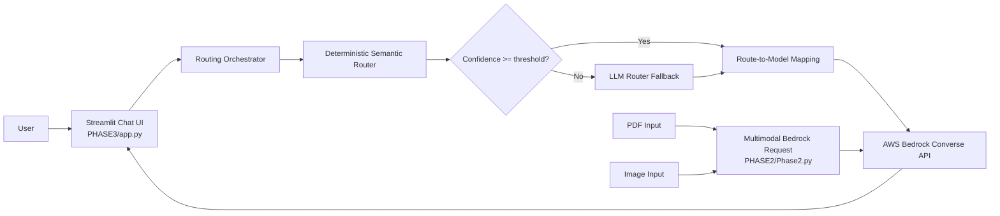
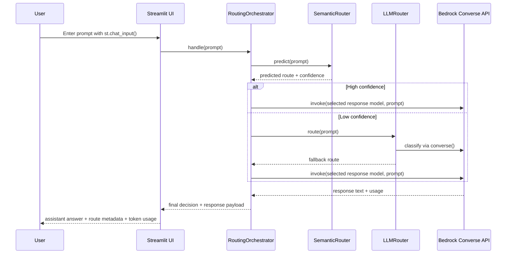

# Implementation Design Document for requirements.md

## 1. Purpose

This document explains how the full set of requirements in `C:\Users\Dell\Desktop\Phase3-AI\KDU-2026-AI\requirements.md` has been implemented across all three phases. The design is presented as one system, with:

- Phase 1 establishing routing and backend orchestration,
- Phase 2 validating multimodal document handling and token usage,
- Phase 3 connecting the backend to a Streamlit frontend and exposing routing transparency to the user.

The document is intentionally overall in scope, but it gives extra detail to the Phase 3 routing flow and frontend-backend integration because that is the final integrated system view.

## 2. System Overview

The implemented solution is a model-agnostic Bedrock-based routing gateway with a Streamlit chat interface.

At a high level, the system does the following:

1. accepts a user prompt,
2. classifies the prompt using a deterministic semantic router,
3. falls back to an LLM router when the semantic decision is not confident enough,
4. invokes the selected model using the raw AWS Bedrock Converse API,
5. returns the model response along with routing metadata and token usage,
6. separately supports multimodal requests for PDF and image analysis to study token and cost behavior.

## 3. Mapping Requirements to Implementation

### Phase 1: Try to Break It

Implemented with:

- `C:\Users\Dell\Desktop\Phase3-AI\KDU-2026-AI\PHASE1\semantic_router.py`
- `C:\Users\Dell\Desktop\Phase3-AI\KDU-2026-AI\PHASE1\llm_router.py`
- `C:\Users\Dell\Desktop\Phase3-AI\KDU-2026-AI\PHASE1\orchestrator.py`
- `C:\Users\Dell\Desktop\Phase3-AI\KDU-2026-AI\PHASE1\app_factory.py`
- `C:\Users\Dell\Desktop\Phase3-AI\KDU-2026-AI\PHASE1\main.py`

Goal addressed:

- route casual prompts and complex code prompts differently,
- prevent ambiguous prompts from escalating unnecessarily,
- keep routing deterministic first and LLM-assisted second.

### Phase 2: Code Read and Audit

Implemented with:

- `C:\Users\Dell\Desktop\Phase3-AI\KDU-2026-AI\PHASE2\Phase2.py`

Goal addressed:

- send PDF and image content through Bedrock Converse,
- inspect usage metadata,
- analyze multimodal token cost and context growth.

### Phase 3: Map and Optimize

Implemented with:

- `C:\Users\Dell\Desktop\Phase3-AI\KDU-2026-AI\PHASE3\app.py`
- reused backend from `PHASE1`

Goal addressed:

- connect the backend routing system to a UI,
- expose route and token usage to the user,
- make routing behavior transparent.

## 4. Implemented Components

### Core backend

- `C:\Users\Dell\Desktop\Phase3-AI\KDU-2026-AI\PHASE1\config.py`: environment-driven configuration
- `C:\Users\Dell\Desktop\Phase3-AI\KDU-2026-AI\PHASE1\models.py`: route/result data models
- `C:\Users\Dell\Desktop\Phase3-AI\KDU-2026-AI\PHASE1\interfaces.py`: abstraction boundaries
- `C:\Users\Dell\Desktop\Phase3-AI\KDU-2026-AI\PHASE1\app_factory.py`: composition root
- `C:\Users\Dell\Desktop\Phase3-AI\KDU-2026-AI\PHASE1\orchestrator.py`: routing workflow coordinator

### Routing layer

- `C:\Users\Dell\Desktop\Phase3-AI\KDU-2026-AI\PHASE1\semantic_router.py`: deterministic embedding-based router
- `C:\Users\Dell\Desktop\Phase3-AI\KDU-2026-AI\PHASE1\llm_router.py`: Bedrock-based fallback classifier

### Bedrock invocation layer

- `C:\Users\Dell\Desktop\Phase3-AI\KDU-2026-AI\PHASE1\bedrock_client.py`: text response invocation
- `C:\Users\Dell\Desktop\Phase3-AI\KDU-2026-AI\PHASE2\Phase2.py`: multimodal PDF and image invocation

### Frontend layer

- `C:\Users\Dell\Desktop\Phase3-AI\KDU-2026-AI\PHASE3\app.py`: Streamlit UI, session state, rendering, metadata display

## 5. Overall Architecture



This diagram represents the complete implementation:

- the main text interaction path comes from Phase 1 and Phase 3 together,
- the multimodal analysis path comes from Phase 2,
- both paths use Bedrock Converse as the common provider interface.

## 6. Routing Method Implemented

This is the central design decision of the system.

The implemented routing method is a hybrid two-stage routing pipeline:

1. deterministic semantic classification first,
2. threshold check,
3. LLM fallback only when needed,
4. final model invocation through Bedrock.

### 6.1 Deterministic semantic router

The deterministic router is implemented in `C:\Users\Dell\Desktop\Phase3-AI\KDU-2026-AI\PHASE1\semantic_router.py`.

How it works:

- route prototypes are defined in `C:\Users\Dell\Desktop\Phase3-AI\KDU-2026-AI\PHASE1\app_factory.py`,
- both prototypes and incoming prompts are embedded using `sentence-transformers/all-MiniLM-L6-v2`,
- a centroid is computed per route,
- cosine similarity is calculated between the query embedding and each route centroid,
- the route with the highest score becomes the predicted label,
- confidence is computed as the gap between the best and second-best scores.

Current route labels:

- `casual_conversation`
- `complex_code_generation`

This stage is deterministic in the sense that the same input and same model state lead to the same semantic decision, unlike a generative classifier.

### 6.2 Threshold-controlled fallback

The orchestrator in `C:\Users\Dell\Desktop\Phase3-AI\KDU-2026-AI\PHASE1\orchestrator.py` decides whether the semantic result is trusted.

Current rule:

- if `semantic_result.confidence >= SEMANTIC_CONFIDENCE_THRESHOLD`, accept the semantic route,
- otherwise call the LLM router.

Current default threshold from `C:\Users\Dell\Desktop\Phase3-AI\KDU-2026-AI\PHASE1\config.py`:

- `0.18`

Why this matters:

- confident simple prompts stay on the cheap path,
- borderline prompts get a second check,
- the system avoids loops because fallback is one-time only.

### 6.3 LLM fallback router

The LLM fallback router is implemented in `C:\Users\Dell\Desktop\Phase3-AI\KDU-2026-AI\PHASE1\llm_router.py`.

It sends a Bedrock Converse request containing:

- a strict system prompt,
- the user query,
- `temperature = 0`,
- `maxTokens = 200`.

The fallback router returns a JSON decision containing:

- route,
- reason,
- confidence.

If the returned output cannot be parsed, the implementation defaults to `casual_conversation`, which is the intentionally cheaper and safer fallback.

### 6.4 Final route-to-model mapping

The final route is mapped to a model using `route_to_model` in `C:\Users\Dell\Desktop\Phase3-AI\KDU-2026-AI\PHASE1\app_factory.py`, and the response is generated by `C:\Users\Dell\Desktop\Phase3-AI\KDU-2026-AI\PHASE1\bedrock_client.py`.

Current checked-in configuration:

- `CASUAL_MODEL_ID = meta.llama3-8b-instruct-v1:0`
- `COMPLEX_MODEL_ID = meta.llama3-8b-instruct-v1:0`
- `ROUTER_MODEL_ID = meta.llama3-8b-instruct-v1:0`

This means the code is architecturally model-agnostic, but the current default configuration does not yet create a real cheap-versus-expensive routing split. The routing design is correct; the cost benefit becomes visible once distinct models are configured through environment variables.

## 7. Phase 3 Integration Design

Although this document is overall in scope, Phase 3 is where the full system becomes visible to the user, so this section explains that integration in detail.

### 7.1 Frontend role

The frontend in `C:\Users\Dell\Desktop\Phase3-AI\KDU-2026-AI\PHASE3\app.py` is intentionally thin. It does not contain routing logic. Instead, it acts as:

- input collector,
- response renderer,
- metadata presenter,
- session state manager.

This separation keeps the routing logic reusable from both CLI and UI.

### 7.2 Orchestrator reuse

The frontend initializes the backend with:

`build_orchestrator()`

This is wrapped in `st.cache_resource`, which avoids rebuilding the embedding model and backend clients on every user interaction.

### 7.3 User request flow



### 7.4 Routing transparency in the UI

After each response, the UI shows:

- selected route,
- route source,
- model used,
- AWS region,
- input tokens,
- output tokens,
- total tokens,
- full routing metadata in an expander,
- Bedrock usage payload in an expander.

This is how transparency is implemented in practice. The requirements mention `st.info()`, while the current code uses `st.metric()`, `st.expander()`, and JSON rendering. The core requirement is still satisfied because the routing choice is visible to the user for every turn.

## 8. Raw Bedrock Converse Payload Design

The implementation avoids high-level wrappers and uses raw Bedrock Converse payload construction.

### 8.1 Router payload

From `C:\Users\Dell\Desktop\Phase3-AI\KDU-2026-AI\PHASE1\llm_router.py`:

```json
{
  "modelId": "<router_model_id>",
  "system": [
    { "text": "You are a routing classifier..." }
  ],
  "messages": [
    {
      "role": "user",
      "content": [
        { "text": "<user_query>" }
      ]
    }
  ],
  "inferenceConfig": {
    "temperature": 0,
    "maxTokens": 200
  }
}
```

### 8.2 Final response payload

From `C:\Users\Dell\Desktop\Phase3-AI\KDU-2026-AI\PHASE1\bedrock_client.py`:

```json
{
  "modelId": "<selected_response_model>",
  "messages": [
    {
      "role": "user",
      "content": [
        { "text": "<user_query>" }
      ]
    }
  ],
  "inferenceConfig": {
    "temperature": 0.2,
    "maxTokens": 1024
  }
}
```

### 8.3 Multimodal payloads

From `C:\Users\Dell\Desktop\Phase3-AI\KDU-2026-AI\PHASE2\Phase2.py`:

- PDF payload includes a `document` block with `format`, `name`, and `source.bytes`
- image payload includes an `image` block with `format` and `source.bytes`

This satisfies the requirement to construct raw Bedrock payloads directly instead of using a higher-level abstraction.

### 8.4 How Bedrock abstracts provider differences

Bedrock standardizes the request pattern around `converse()` using:

- `modelId`
- `system`
- `messages`
- `inferenceConfig`

This is the provider abstraction benefit. The application logic does not have to create different code paths for Anthropic-style versus Meta-style payload formats. The design remains stable while only the `modelId` changes.

## 9. Phase 2 Findings and Token Analysis

The measured usage metadata for the multimodal run is:

- PDF usage: `inputTokens=3101`, `outputTokens=231`, `totalTokens=3332`
- Image usage: `inputTokens=1747`, `outputTokens=150`, `totalTokens=1897`

These values confirm three design conclusions:

1. multimodal requests are significantly heavier than normal text-only prompts,
2. PDF inputs can consume much larger context budget than expected,
3. repeated inclusion of the same document would increase both cost and latency rapidly.

If the same PDF is sent 100 times in chat history:

- input cost grows dramatically,
- latency increases because the same document must be reprocessed repeatedly,
- context window pressure increases and can eventually block further useful conversation.

The correct optimization strategy is therefore:

- process the document once,
- retain a summary or extracted facts,
- avoid resending the full file in repeated turns.

## 10. Design Decisions

### Decision 1: deterministic routing before LLM routing

Reason:

- lower cost,
- better consistency,
- reduced unnecessary escalation.

### Decision 2: threshold-based fallback instead of direct LLM classification for every query

Reason:

- keeps the majority of easy requests cheap,
- reserves model-based classification for ambiguous prompts.

### Decision 3: Bedrock Converse as the unified invocation layer

Reason:

- consistent payload structure,
- easier provider abstraction,
- cleaner model-agnostic design.

### Decision 4: frontend separated from routing logic

Reason:

- UI remains simple,
- backend remains reusable,
- testing and extension are easier.

### Decision 5: explicit routing metadata shown in the UI

Reason:

- improves trust,
- supports debugging,
- makes cost-aware behavior visible.

## 11. Answers to Questions in requirements.md

### 11.1 Phase 1 questions

#### Q: How often did your classifier incorrectly route borderline prompts to Sonnet?

For the canonical borderline example, "Write a casual python script to say hello to my friend", the current implementation is intentionally biased toward the cheaper route.

Why:

- semantic prototypes include `tiny python script` and `simple hello world code`,
- the fallback LLM router explicitly classifies very simple coding tasks as `casual_conversation`,
- invalid fallback output also defaults to the cheaper route.

A precise misrouting frequency cannot be claimed from the repository alone because no formal benchmark dataset is stored. The most accurate answer is:

- expected misrouting on the canonical borderline prompt: low,
- exact measured rate across a dataset: not available in the current implementation.

#### Q: What trade-offs did you observe between cost vs accuracy?

Observed design trade-off:

- lower thresholds reduce fallback cost and latency, but may misclassify ambiguous prompts,
- higher thresholds improve caution and accuracy, but invoke the fallback router more often.

In short:

- cheaper routing usually reduces accuracy on borderline cases,
- safer routing usually increases cost and latency.

#### Q: Compare native Anthropic API payload vs AWS Bedrock Converse API payload.

Native Anthropic payloads are provider-specific. Bedrock Converse payloads are provider-normalized.

In this implementation, the application only needs a common structure based on:

- `modelId`
- `system`
- `messages`
- `inferenceConfig`

That makes the gateway easier to maintain and keeps the routing layer independent from provider-specific request formatting.

#### Q: How does Bedrock abstract provider differences?

Bedrock abstracts provider differences by offering a unified `converse()` interface. The application changes the `modelId`, while the surrounding request structure stays mostly stable. That is the key reason this project can be implemented as a model-agnostic gateway.

### 11.2 Phase 2 questions

#### Q: How many tokens did the PDF consume?

The measured PDF request consumed:

- input tokens: `3101`
- output tokens: `231`
- total tokens: `3332`

#### Q: What happens if the same PDF is sent 100 times in chat history?

The system would become inefficient in three ways:

- cost would increase because the same large input tokens are billed repeatedly,
- latency would increase because the document must be reprocessed each time,
- context window usage would grow until it starts crowding out more useful conversational context.

#### Q: Consider latency impact, cost implications, and context window limits.

The measured results support the following conclusion:

- PDF total tokens: `3332`
- image total tokens: `1897`

Because the PDF request is substantially heavier, repeated document reuse should be avoided. The better design is to keep a compressed summary or extracted facts rather than reattaching the raw asset.

### 11.3 Phase 3 questions

#### Q: What is the cost difference between direct Sonnet usage and a routed architecture?

Architecturally, routed usage is cheaper when many requests can stay on a cheaper route and only a subset escalates.

General comparison for 10,000 requests:

- direct expensive path:
  - `10000 * cost(expensive_model)`
- routed path:
  - `10000 * cost(routing_step)`
  - `+ escalated_requests * cost(expensive_model)`
  - `+ non_escalated_requests * cost(cheap_model)`

Important implementation note:

the current checked-in configuration points casual, complex, and router paths to the same model ID. So the present codebase demonstrates the routing architecture and transparency correctly, but not the full cost difference numerically by default.

#### Q: When is routing not worth it?

Routing is not worth it when:

- nearly all prompts require the expensive model anyway,
- the router itself is too costly relative to the saving,
- latency matters more than marginal cost reduction,
- the prompt distribution is simple and predictable enough for a single model choice.

#### Q: How does UI feedback improve system transparency?

UI feedback improves transparency because each response exposes:

- which route was chosen,
- whether that decision came from semantic routing or fallback routing,
- which model answered,
- how many tokens were used.

That makes the system behavior inspectable instead of hidden.

## 12. Risks and Limitations

### 12.1 Same-model default configuration

The current configuration uses the same model ID for all routing paths. This means:

- architecture is model-agnostic,
- transparency works,
- true cost optimization is not yet fully demonstrated in default settings.

### 12.2 No formal routing benchmark

There is no labeled evaluation suite in the repository, so routing accuracy claims should remain careful.

### 12.3 Token findings are document-specific

The measured token counts are valid for the provided sample files, but different documents and images will produce different usage numbers.

### 12.4 Minor mismatch with UI wording requirement

The requirement mentions `st.info()`, while the implementation uses `st.metric()`, expanders, and JSON blocks. The transparency outcome is achieved, but the exact widget differs.

## 13. Recommended Improvements

1. Configure distinct cheap and expensive model IDs so the cost benefit becomes measurable in the integrated system.
2. Add a benchmark script with labeled borderline prompts to quantify routing accuracy.
3. Add explicit cost estimation logic for the 10,000-query comparison.
4. Add a visible routing badge using `st.info()` if exact requirement wording must be matched.
5. Add session analytics such as escalation rate, average tokens, and average latency.

## 14. Conclusion

The requirements have been implemented as one coherent architecture rather than three disconnected tasks.

- Phase 1 built the routing backend.
- Phase 2 validated multimodal payload handling and token behavior.
- Phase 3 connected the backend to a user-facing Streamlit application.

The final system is modular, Bedrock-based, routing-aware, and transparent to the user. Its strongest design feature is the hybrid routing strategy: deterministic first, fallback second, inference last. Its main current limitation is configuration rather than architecture, because the checked-in model IDs do not yet create a true cheap-versus-expensive split.
