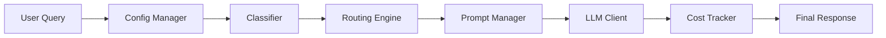
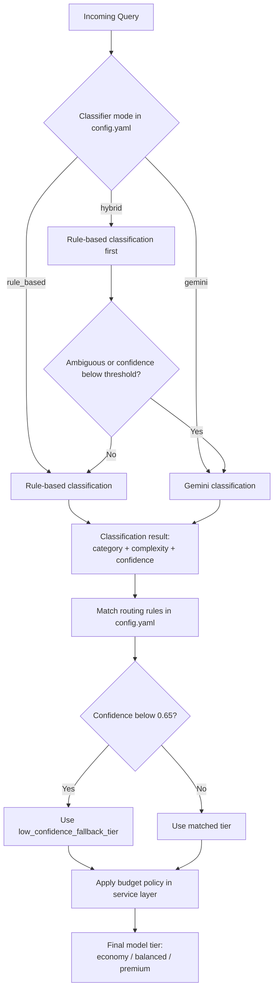

# Architecture Diagrams

# **1. End-to-End Flow**

```mermaid
flowchart LR
    A["User Query"] --> B["Config Manager"]
    B --> C["Classifier"]
    C --> D["Routing Engine"]
    D --> E["Prompt Manager"]
    E --> F["LLM Client"]
    F --> G["Cost Tracker"]
    G --> H["Final Response"]
```

# 2. Classification and Routing Logic

```mermaid
flowchart TD
    A["Incoming Query"] --> B{"Classifier mode in config.yaml"}

    B -->|rule_based| C["Rule-based classification"]
    B -->|gemini| D["Gemini classification"]
    B -->|hybrid| E["Rule-based classification first"]

    E --> F{"Ambiguous or confidence below threshold?"}
    F -->|Yes| D
    F -->|No| C

    C --> G["Classification result:
category + complexity + confidence"]
    D --> G

    G --> H["Match routing rules in config.yaml"]
    H --> I{"Confidence below 0.65?"}
    I -->|Yes| J["Use low_confidence_fallback_tier"]
    I -->|No| K["Use matched tier"]

    J --> L["Apply budget policy in service layer"]
    K --> L

    L --> M["Final model tier:
economy / balanced / premium"]
```
