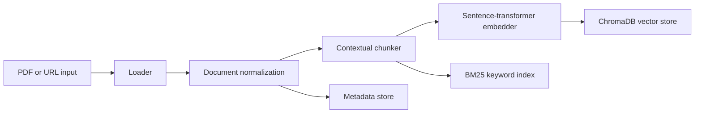
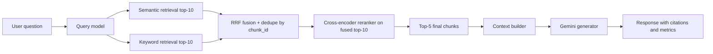

# Hybrid-Search RAG Chatbot - Low-Level Design

This document describes the current implementation-oriented low-level design for the Hybrid-Search RAG Chatbot. It reflects the active codebase and the locked defaults in [implementation_decisions.md](/C:/Users/Dell/Desktop/Phase3-AI/KDU-2026-AI/docs/implementation_decisions.md).

## 1. Purpose

The system ingests PDFs and blog-style URLs, normalizes them into a shared document contract, performs contextual chunking, stores both vector and keyword indexes locally, retrieves evidence with hybrid search, reranks candidates, and generates grounded answers with citations in a Streamlit UI.

## 2. Locked Defaults

- UI: `Streamlit`
- Vector store: `ChromaDB`
- Keyword retrieval: `BM25`
- Embeddings: `sentence-transformers`
- Generator: Gemini chat model
- Reranker: cross-encoder reranker
- Chunking: contextual chunking with `chunk_size=512` and `overlap=50`
- Retrieval flow: semantic top-10 + keyword top-10 -> RRF fusion -> rerank fused top-10 -> generate from reranked top-5

## 3. System Overview

### 3.1 End-to-End Ingestion Flow



### 3.2 End-to-End Query Flow



## 4. Design Principles

- Keep all major components behind interfaces.
- Preserve stable contracts between ingestion, retrieval, generation, and UI.
- Keep orchestration outside the Streamlit callbacks.
- Preserve traceability on every chunk and citation path.
- Degrade gracefully when reranking or generation is unavailable.
- Persist indexes locally across restarts.

## 5. Package Layout

The repository is organized around clear layer boundaries.

```text
src/
  core/
    interfaces/
    models/
    config/
  ingestion/
    loaders/
    chunkers/
    embedders/
    pipeline.py
  storage/
    vector_stores/
    keyword_stores/
    metadata_store.py
  retrieval/
    retrievers/
    fusion/
    rerankers/
    pipeline.py
  generation/
    llms/
    prompts/
    context_builder.py
    generator.py
  orchestration/
    rag_pipeline.py
    session_manager.py
    cache_manager.py
  utils/
ui/
  app.py
  components/
config/
tests/
scripts/
data/
```

## 6. Core Contracts

### 6.1 `Document`

Represents a normalized source before chunking.

Required fields:

- `document_id`
- `source_type`
- `source`
- `title`
- `content`
- `metadata`
- `created_at`

Typical metadata includes:

- resolved file path or canonical URL
- page hints for PDFs
- extracted section information for URLs

### 6.2 `Chunk`

Represents a traceable retrieval unit.

Required fields:

- `chunk_id`
- `document_id`
- `text`
- `position`
- `start_offset`
- `end_offset`
- `section_title`
- `metadata`

Chunk metadata must preserve:

- `document_id`
- `chunk_id`
- `position`
- `start_offset`
- `end_offset`
- source metadata
- section type or page metadata where available

### 6.3 `Query`

Represents a user request entering retrieval and generation.

Required fields:

- `query_text`
- `top_k`
- `filters`
- `session_id`

### 6.4 `Response`

Represents the final grounded answer returned to the UI.

Required fields:

- `answer`
- `sources`
- `retrieved_chunks`
- `latency_ms`
- `metadata`

The response carries:

- final answer text
- citation objects with chunk traceability
- retrieved chunks for debugging and UI inspection
- latency and error metadata

## 7. Layer Design

### 7.1 Core Layer

Location: `src/core/`

Responsibilities:

- define interfaces for loaders, chunkers, embedders, stores, retrievers, rerankers, and LLM providers
- define typed models shared across layers
- load settings and constants

This layer contains no provider-specific business logic.

### 7.2 Ingestion Layer

Location: `src/ingestion/`

Responsibilities:

- load PDFs and URLs into `Document`
- normalize source metadata
- split content using contextual chunking
- generate embeddings in batches
- persist chunk artifacts through storage interfaces

Implemented source support:

- `pdf_loader.py`
- `url_loader.py`
- `text_loader.py` for normalization and tests

Chunking components:

- `contextual_chunker.py` as default strategy
- `recursive_chunker.py` as fallback splitter

Implementation notes:

- PDF ingestion preserves order and page hints where available.
- URL ingestion extracts readable article content, headings, and summary facts.
- Re-ingesting the same `document_id` replaces prior indexed artifacts.

### 7.3 Storage Layer

Location: `src/storage/`

Responsibilities:

- persist vector embeddings in ChromaDB
- persist keyword retrieval state in BM25-backed storage
- persist document and chunk metadata

Components:

- `vector_stores/chroma_store.py`
- `keyword_stores/bm25_store.py`
- `metadata_store.py`

Persistence rules:

- indexes must survive restarts
- vector, keyword, and metadata layers must stay aligned by `document_id` and `chunk_id`
- upserts for an existing `document_id` must replace prior entries instead of duplicating them

### 7.4 Retrieval Layer

Location: `src/retrieval/`

Responsibilities:

- retrieve semantic candidates from the vector store
- retrieve keyword candidates from the BM25 store
- fuse and deduplicate by `chunk_id`
- rerank the fused candidate set
- return a stable top-5 ranked set for generation

Components:

- `retrievers/semantic_retriever.py`
- `retrievers/keyword_retriever.py`
- `retrievers/hybrid_retriever.py`
- `fusion/rrf_fusion.py`
- `rerankers/cross_encoder_reranker.py`
- `pipeline.py`

Retrieval behavior:

1. semantic retrieval returns top-10
2. keyword retrieval returns top-10
3. results are fused via RRF
4. duplicates are removed by `chunk_id`
5. fused top-10 are reranked when the reranker is available
6. final top-5 are returned to generation

Fallback behavior:

- if the reranker cannot load or fails, the fused order is returned instead of failing the query

### 7.5 Generation Layer

Location: `src/generation/`

Responsibilities:

- build prompts from the final retrieved chunks
- assemble a grounded context payload
- call the Gemini provider
- return a response with citations and user-readable failure metadata

Components:

- `llms/gemini_llm.py`
- `llms/llm_factory.py`
- `prompts/qa_prompts.py`
- `prompts/contextual_prompts.py`
- `prompts/prompt_manager.py`
- `context_builder.py`
- `generator.py`

Generation policy:

- answer only from retrieved context
- if context is insufficient, explicitly say the answer is not available from the provided sources
- every answer must include citations referencing title or source and chunk position
- only the reranked final chunk set is sent into generation

### 7.6 Orchestration Layer

Location: `src/orchestration/`

Responsibilities:

- coordinate ingestion and query flows
- manage session-scoped state
- apply session overrides over default settings
- cache responses where appropriate

Components:

- `rag_pipeline.py`
- `session_manager.py`
- `cache_manager.py`

The orchestration layer is the boundary used by the Streamlit UI.

### 7.7 UI Layer

Location: `ui/`

Responsibilities:

- render the Streamlit app
- collect source inputs and session settings
- display grounded answers, citations, and metrics
- surface user-readable errors

Components:

- `app.py`
- `components/settings_panel.py`
- `components/document_uploader.py`
- `components/chat_interface.py`
- `components/metrics_display.py`

Current workflow:

- session settings are shown in the sidebar
- source upload and URL ingestion controls are shown in the sidebar
- active sources are shown in the sidebar
- chat and answer rendering remain in the main pane

## 8. Configuration Model

### 8.1 Sources of Configuration

- `config/config.yaml` stores default runtime values
- `.env` stores secrets
- UI controls provide session-scoped overrides

### 8.2 Precedence

Configuration precedence is:

1. active UI session overrides
2. `.env` secrets
3. `config.yaml` defaults

### 8.3 Important Runtime Areas

- chunking settings
- retrieval top-k settings
- generation provider, model, temperature, and max tokens
- local persistence paths
- logging configuration

## 9. Session and Error Handling

### 9.1 Session State

Each Streamlit session maintains:

- a `session_id`
- active document identifiers
- answer history
- per-session settings overrides
- last user-visible error

### 9.2 Failure Handling

The system should not crash the app for normal runtime failures.

Handled cases include:

- malformed PDFs
- unreadable or unreachable URLs
- empty retrieval results
- reranker load failures
- Gemini/API failures

User-facing behavior:

- ingestion errors are shown in the UI
- answer-generation failures are surfaced without losing the retrieved evidence view
- insufficient context responses are explicit rather than fabricated

## 10. Logging

Structured logs should be emitted for:

- ingestion start and completion
- chunking and persistence
- retrieval start and completion
- reranking completion or fallback
- generation start, insufficient-context outcomes, and failures
- orchestration start and completion

## 11. Testing Strategy

Tests are organized under `tests/` and include both unit and integration coverage.

Unit coverage focuses on:

- loaders
- chunkers
- storage boundaries
- retrieval ordering and fusion
- generation helpers and citation behavior
- UI import and rendering boundaries

Integration coverage focuses on:

- ingestion pipeline
- retrieval pipeline
- RAG pipeline happy-path behavior

Validation expectations for meaningful feature work:

- changed modules get focused tests
- retrieval changes validate ordering, not just presence
- generation changes validate citation or insufficient-context behavior

## 12. Extension Rules

The design is intentionally interface-driven so that providers can be swapped later. Any extension should:

- implement the correct core interface
- register in the relevant factory
- preserve the existing model contracts
- avoid coupling directly across layers

Examples of valid future extensions:

- additional document loaders
- alternative vector stores behind the same interface
- alternative LLM providers
- additional rerankers

These should be added without changing the stable orchestration and UI contracts.

## 13. Current Implementation Notes

This LLD reflects the implemented project, not just an aspirational scaffold.

Important current notes:

- Gemini is the default generation provider.
- Streamlit is the active UI runtime.
- Citations expose the full retrieved chunk content in the UI for debugging.
- URL ingestion and chunking have been simplified to reduce noisy fragments and improve factual retrieval.
- The architecture still preserves provider abstraction and testability despite these simplifications.

## 14. Summary

The system is a layered, interface-driven RAG application with:

- normalized document ingestion
- local persistent vector and keyword storage
- hybrid retrieval with reranking
- grounded answer generation
- session-aware Streamlit interaction

This structure keeps the codebase testable, extensible, and aligned with the locked implementation decisions.
