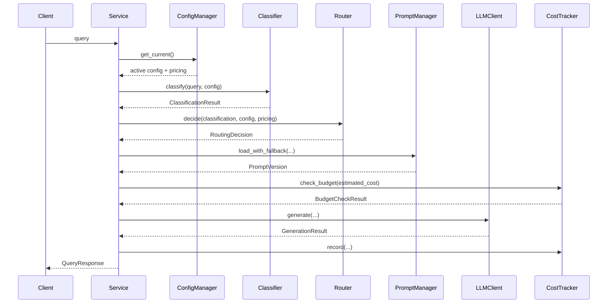

# Low-Level Design

## Overview

This document describes the implemented low-level design of the FixIt LLMOps support system. The solution is local-first, configuration-driven, and designed to make routing, prompts, budgets, and fallback behavior observable and testable.

Version: 1.2  
Date: April 19, 2026

## Goals

- classify support queries into a small controlled taxonomy
- route each query to the least expensive acceptable model tier
- manage prompts externally with explicit versioning
- track estimated and actual cost
- apply budget and failure fallbacks predictably
- support both mock-safe local testing and real Gemini execution

## High-Level Flow

1. Load the active configuration bundle from `configs/`
2. Classify the query
3. Route to a model tier and prompt
4. Load and render the prompt
5. Estimate request cost and apply budget policy
6. Generate a response through the provider client
7. Retry on cheaper tiers if generation fails
8. Record actual usage, cost, and prompt metrics
9. Return response text plus routing and fallback metadata

## Architecture



## Module Design

### Config Loader

Files:

- [src/config_loader/config_loader.py](C:/Users/Dell/Desktop/Phase3-AI/KDU-2026-AI/src/config_loader/config_loader.py)
- [configs/config.yaml](C:/Users/Dell/Desktop/Phase3-AI/KDU-2026-AI/configs/config.yaml)
- [configs/pricing.yaml](C:/Users/Dell/Desktop/Phase3-AI/KDU-2026-AI/configs/pricing.yaml)

Responsibilities:

- load YAML config and pricing files
- validate against typed models
- cache current config bundle
- reload when file mtimes change
- keep the last known valid config if reload fails

### Classifier

Files:

- [src/classifier/classifier.py](C:/Users/Dell/Desktop/Phase3-AI/KDU-2026-AI/src/classifier/classifier.py)
- [src/classifier/rules.py](C:/Users/Dell/Desktop/Phase3-AI/KDU-2026-AI/src/classifier/rules.py)

Supported modes:

- `rule_based`
- `gemini`
- `hybrid`

Current implementation details:

- `rule_based` uses keyword and substring checks for `FAQ`, `booking`, and `complaint`
- `gemini` asks Gemini for strict JSON classification
- `hybrid` uses rule-based classification first and escalates to Gemini only when the rule result is ambiguous or below the configured confidence threshold
- Gemini classification can fall back to rule-based behavior if enabled in config

`ClassificationResult` contains:

- `category`
- `complexity`
- `expected_response_type`
- `confidence`
- `source`
- `model_id`
- `fallback_reason`
- `usage_details`

### Router

Files:

- [src/router/routing_engine.py](C:/Users/Dell/Desktop/Phase3-AI/KDU-2026-AI/src/router/routing_engine.py)

Responsibilities:

- map classification output to a model tier and prompt reference using config-defined rules
- apply low-confidence fallback tier selection
- produce an initial estimated route cost

The router itself does not apply budget pressure. Budget-driven downgrades are applied later in the service layer.

### Prompt Manager

Files:

- [src/prompt_manager/prompt_manager.py](C:/Users/Dell/Desktop/Phase3-AI/KDU-2026-AI/src/prompt_manager/prompt_manager.py)
- [src/prompt_manager/metadata_tracker.py](C:/Users/Dell/Desktop/Phase3-AI/KDU-2026-AI/src/prompt_manager/metadata_tracker.py)

Responsibilities:

- load prompts from `prompts/<key>/v<version>.yaml`
- render prompt templates with runtime variables
- fall back from selected prompt to configured base prompt
- fall back again to a built-in prompt if files are missing
- track prompt runtime metrics in `data/prompt_metrics.json`

### LLM Client

Files:

- [src/llm_client/client.py](C:/Users/Dell/Desktop/Phase3-AI/KDU-2026-AI/src/llm_client/client.py)

Responsibilities:

- expose one adapter boundary for provider-specific behavior
- support text generation
- support Gemini-backed classification
- return token usage metadata when available

Supported provider modes:

- `mock`
- `gemini`

### Cost Tracker

Files:

- [src/cost_control/cost_tracker.py](C:/Users/Dell/Desktop/Phase3-AI/KDU-2026-AI/src/cost_control/cost_tracker.py)

Responsibilities:

- estimate cost before invocation
- record actual usage after invocation
- calculate projected daily and monthly totals
- determine budget mode:
  - `normal`
  - `warning`
  - `critical`
  - `degraded`

Current implementation includes classification cost in totals when classification is performed by Gemini.

### Application Service

Files:

- [src/api/service.py](C:/Users/Dell/Desktop/Phase3-AI/KDU-2026-AI/src/api/service.py)

Responsibilities:

- coordinate end-to-end request handling
- refresh active config before each query
- apply budget-based route adjustment
- handle generation fallback to cheaper tiers
- return structured response metadata

## Configuration Design

The primary runtime controls live in [configs/config.yaml](C:/Users/Dell/Desktop/Phase3-AI/KDU-2026-AI/configs/config.yaml).

Main config sections:

- `app`
- `feature_flags`
- `classifier`
- `cost_limits`
- `models`
- `routing`
- `prompts`

Classifier config:

```yaml
classifier:
  mode: rule_based
  provider: gemini
  model_id: gemini-2.5-flash-lite
  low_confidence_threshold: 0.65
  fallback_to_rule_based_on_error: true
```

Routing config includes:

- default prompt key/version
- category and complexity rules
- low-confidence fallback tier

## Prompt Design

Prompts are stored as versioned YAML files:

- `prompts/faq/v1.yaml`
- `prompts/booking/v1.yaml`
- `prompts/complaint/v1.yaml`
- `prompts/base/v1.yaml`

Prompt selection is explicit through routing rules and prompt fallback behavior is test-covered.

## Cost and Fallback Design

Implemented fallback chain:

- invalid config reload -> keep last valid config
- missing prompt -> base prompt -> built-in fallback prompt
- generation failure -> retry cheaper tier
- all generation attempts fail -> local degraded response
- Gemini classification failure -> rule-based fallback when enabled

Budget policy:

- `warning`: downgrade premium traffic when possible
- `critical`: downgrade more aggressively while preserving complaint/high-risk handling
- `degraded`: force cheapest route and base prompt

## Local Setup and Entry Points

Dependencies:

- `pytest`
- `pyyaml`
- `pydantic`

Entry points:

- [scripts/query_app.py](C:/Users/Dell/Desktop/Phase3-AI/KDU-2026-AI/scripts/query_app.py)
- [scripts/run_evaluation.py](C:/Users/Dell/Desktop/Phase3-AI/KDU-2026-AI/scripts/run_evaluation.py)
- [scripts/run_local.py](C:/Users/Dell/Desktop/Phase3-AI/KDU-2026-AI/scripts/run_local.py)

Runtime variables:

- `PROVIDER_MODE`
- `GEMINI_API_KEY`
- `GEMINI_API_BASE_URL`
- `GEMINI_TIMEOUT_SECONDS`

## Testing Strategy

The repository contains deterministic unit and integration tests covering:

- config loading and reload fallback
- classifier modes and confidence behavior
- routing decisions
- prompt selection and prompt fallback
- prompt runtime metrics
- budget degradation
- generation fallback
- degraded response behavior
- CLI output paths
- evaluation workflow outputs

Run all tests:

```powershell
python -m pytest
```

## Deliverable Artifacts

- Prompt metrics: [data/prompt_metrics.json](C:/Users/Dell/Desktop/Phase3-AI/KDU-2026-AI/data/prompt_metrics.json)
- Evaluation report: [reports/evaluation_report.json](C:/Users/Dell/Desktop/Phase3-AI/KDU-2026-AI/reports/evaluation_report.json)
- Evaluation results: [reports/evaluation_results.csv](C:/Users/Dell/Desktop/Phase3-AI/KDU-2026-AI/reports/evaluation_results.csv)

## Known Limitation

The implementation still benefits from a separate before-vs-after cost analysis document if that deliverable must be submitted independently from the evaluation report.
