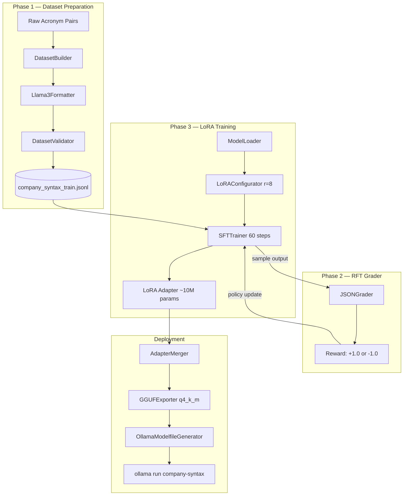
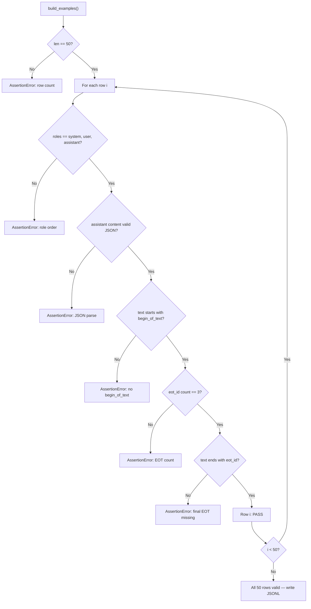
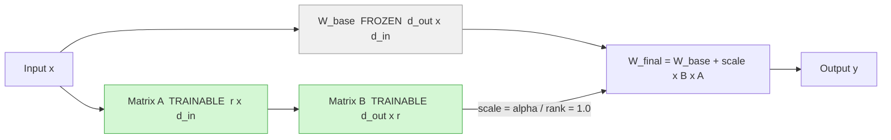
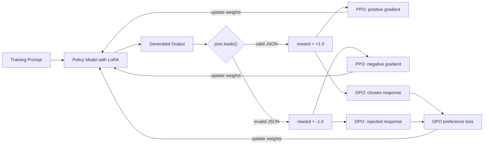
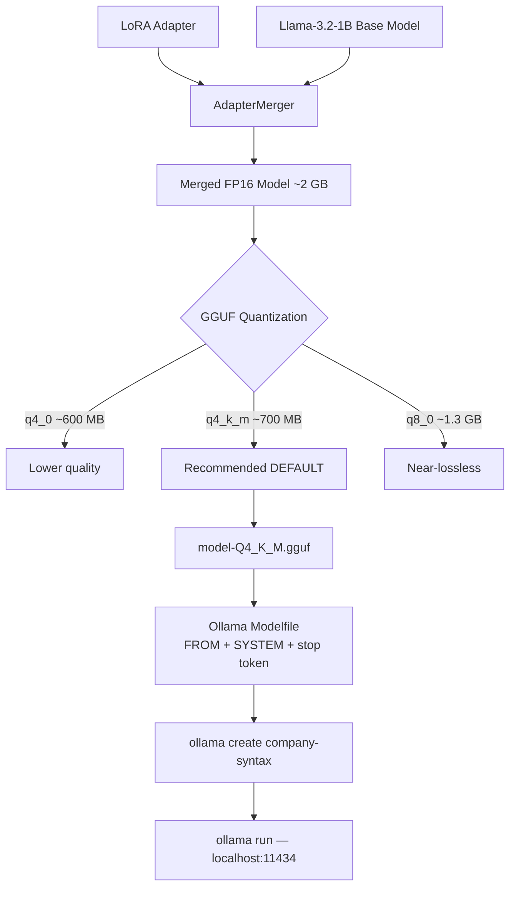

# KDU 2026 AI — Model Optimization Design Document
### LoRA + Reinforcement Fine-Tuning Pipeline

---

# 1. System Architecture

A parameter-efficient fine-tuning pipeline that teaches a lightweight 1B LLM to convert proprietary company acronyms (HDO, INC, RCA, etc.) into strict structured JSON. Full fine-tuning is replaced by LoRA adapters trained via Supervised Fine-Tuning (SFT), with a programmable JSON grader providing the reward signal for Reinforcement Fine-Tuning (RFT). The final adapter is merged into the base model and exported as a quantized GGUF file for local deployment via Ollama.



**Data Flow:**

1. Raw company acronym/department pairs are templated into 50 JSONL training examples.
2. Each example is formatted in Llama 3 instruction format with explicit `<|eot_id|>` end-of-turn tokens.
3. The dataset is validated (role order, JSON validity, EOT count) and written to `company_syntax_train.jsonl`.
4. The base model (`Llama-3.2-1B-Instruct`) is loaded in 4-bit quantization via Unsloth.
5. LoRA adapter matrices (rank 8) are attached to attention and feed-forward projection layers.
6. SFTTrainer fine-tunes only the adapter weights over 60 steps using the formatted training text.
7. A programmable JSON grader evaluates each model output and returns `+1.0` (valid) or `−1.0` (invalid) as the RFT reward signal.
8. The trained LoRA adapter is merged into the base model weights (16-bit).
9. The merged model is exported as a 4-bit quantized GGUF file (`q4_k_m`).
10. An Ollama Modelfile is generated for local inference deployment.

---

# 2. Tech Stack

| Layer | Technology / Tool | Purpose | Why Chosen |
|-------|-------------------|---------|------------|
| Base Model | `unsloth/Llama-3.2-1B-Instruct-bnb-4bit` | Foundation model for fine-tuning | Small enough for free T4 GPU; Llama 3 family supports structured instruction following |
| Training Framework | Unsloth | Fast LoRA training with 4-bit support | 2x faster than vanilla PEFT on T4, built-in GGUF export |
| Adapter Method | PEFT / LoRA | Parameter-efficient fine-tuning | Trains <2% of model parameters; no full FP32 weights needed |
| SFT Trainer | TRL `SFTTrainer` | Supervised fine-tuning loop | Native Unsloth integration, handles dataset text field directly |
| Dataset Handling | HuggingFace `datasets` | Load and stream JSONL training data | Standard format, compatible with SFTTrainer |
| Model Base | HuggingFace `transformers` | Tokenizer + model architecture | Required by Unsloth and TRL |
| Mixed Precision | `accelerate` + BF16/FP16 | Reduce VRAM during training | Auto-detected by Unsloth per GPU capability |
| Quantization (Training) | `bitsandbytes` | 4-bit NF4 loading + 8-bit AdamW optimizer | Halves VRAM vs FP16; 8-bit optimizer reduces optimizer state memory |
| Export Format | GGUF (`q4_k_m`) | Portable quantized model for llama.cpp / Ollama | 3x smaller than FP16; CPU/GPU compatible; Ollama-native |
| Local Deployment | Ollama | Serve GGUF model via REST API | Zero-infrastructure local inference with stop-token support |
| Reward / Grader | Python `json.loads()` | Binary JSON validity grader for RFT | Deterministic, zero-cost, no auxiliary model needed |
| Training Environment | Google Colab (T4 GPU) | Cloud GPU for training | No local GPU available; free T4 fits the 1B model |
| Config / Env | `python-dotenv` + `PyYAML` | Environment and config management | Keeps API keys out of code |
| API Provider | OpenRouter / Groq (free tier) | LLM inference for dev/eval steps | Low cost; Llama 3 models available without GPT-4 class pricing |

---

# 3. Verification Pipeline — Step by Step

---

## Step 1: Dataset Format Validation

*Purpose:*
Ensure every training example has the correct Llama 3 structure before training begins. A single malformed example can corrupt the model's token boundary learning.

*Example:*
```
Input row:  {"messages": [...], "text": "<|begin_of_text|><|start_header_id|>system..."}
Check:      roles == ["system", "user", "assistant"]
            text.count("<|eot_id|>") == 3
            text.endswith("<|eot_id|>")
            json.loads(messages[-1]["content"]) succeeds
Result:     PASS or AssertionError with row number
```

*Key Design Decisions:*

- *Decision:* Use Llama 3 instruction format over ChatML.
- *Options Considered:* ChatML (`<|im_start|>`), Llama 3 (`<|start_header_id|>`), plain separator tokens.
- *Why This Decision:* The base model (`Llama-3.2-1B-Instruct`) was pre-trained on Llama 3 instruction tokens. Using the native format means the model already understands these boundaries, so the fine-tuning cost is lower and convergence is faster. ChatML would require the model to learn new token semantics from scratch on 50 examples — insufficient for reliable learning.

- *Decision:* Assert exactly 3 `<|eot_id|>` tokens per example (not ≥ 3).
- *Options Considered:* Check count >= 1, check count == 3, no check.
- *Why This Decision:* Exactly 3 means one per turn (system, user, assistant). Fewer means a missing boundary; more means an extra turn was accidentally appended. The strict equality catches both failure modes and prevents the model from learning inconsistent stopping behaviour.

*Diagram:*



---

## Step 2: LoRA Adapter Attachment Verification

*Purpose:*
Confirm that the adapter is attached to the correct target layers and that the trainable parameter ratio is within the expected range (~1–2% of total).

*Example:*
```
Total parameters:     1,235,814,400
Trainable (LoRA r=8):    10,485,760   (0.85%)
Target modules:       q_proj, k_proj, v_proj, o_proj,
                      gate_proj, up_proj, down_proj
```

*Key Design Decisions:*

- *Decision:* Target all 7 projection layers (attention + FFN), not just attention.
- *Options Considered:* Attention-only (`q, k, v, o`), attention + FFN (`gate, up, down`), all linear layers.
- *Why This Decision:* For structured output tasks, the feed-forward layers (SwiGLU `gate/up/down`) are responsible for the model's "factual recall" of schema keys and values. Fine-tuning only attention would teach the model when to output JSON but not what keys to use. Targeting all 7 modules gives sufficient capacity at still under 1% trainable parameters.

- *Decision:* Set `lora_alpha = lora_rank` (scaling factor of 1.0).
- *Options Considered:* `alpha = rank` (scale = 1.0), `alpha = 2 * rank` (scale = 2.0), `alpha = 16` fixed.
- *Why This Decision:* With `alpha = rank`, the effective weight update `ΔW = (alpha/rank) * B*A = 1.0 * B*A` means the adapter contributes at full magnitude without amplification. This is the safest default for small datasets — higher alpha can cause overconfident weight updates and instability on 50 training rows.

*Diagram — LoRA Adapter Structure:*



---

## Step 3: Training Loss Monitoring

*Purpose:*
Verify that the model is actually learning the structured output format, not memorising random noise or diverging.

*Example:*
```
Step  5: loss = 2.31
Step 20: loss = 1.45
Step 40: loss = 0.82
Step 60: loss = 0.61   <- expected range: 0.4 – 0.8 for 50-row dataset
```

*Key Design Decisions:*

- *Decision:* Use 60 training steps with `logging_steps=5`.
- *Options Considered:* Full epoch training, 30 steps, 60 steps, 120 steps.
- *Why This Decision:* With 50 training rows and effective batch size 8, one epoch is ~6 steps. At 60 steps the model sees each example ~10 times — enough to learn the schema structure without memorising the exact 50 prompts. Beyond ~100 steps on this dataset, loss continues falling but generalisation degrades (overfitting to the 50 specific prompts rather than the pattern).

- *Decision:* Use `adamw_8bit` optimizer.
- *Options Considered:* Adam FP32, AdamW FP32, AdamW 8-bit, SGD.
- *Why This Decision:* 8-bit AdamW stores optimizer states (momentum, variance) in 8-bit instead of 32-bit, reducing optimizer VRAM by ~75%. On a T4 (15 GB) with a 1B model already occupying ~4 GB in 4-bit, this keeps total VRAM under 8 GB and leaves headroom for activation gradients.

---

## Step 4: Inference Output Grading

*Purpose:*
After training, run the model on held-out prompts and score each output with the programmable JSON grader to measure whether the format objective was achieved.

*Example:*
```
Prompt:  "Convert this P2 INC request for team SEC into the company JSON schema."
Output:  {"request_code":"INC","request_expansion":"incident","request_type":"service_incident","department":"SEC","department_name":"Security Operations","priority":"P2"}
Grader:  json.loads(output) -> SUCCESS -> score = +1.0
```

*Key Design Decisions:*

- *Decision:* Binary `+1.0 / −1.0` reward, not a graded partial score.
- *Options Considered:* Binary, partial scoring (key presence ratio), cosine similarity to expected output.
- *Why This Decision:* JSON is structurally binary — it either parses or it doesn't. A partial score based on key presence would require a reference answer and adds complexity without improving training signal for the format objective. The binary signal cleanly separates the one thing we care about (parseable output) from everything else, making PPO/DPO updates unambiguous.

- *Decision:* Use `json.loads()` as the grader, not a schema validator.
- *Options Considered:* `json.loads()` only, `jsonschema.validate()`, regex check.
- *Why This Decision:* `json.loads()` is the minimum viable check for the stated objective ("strict JSON outputs"). Schema validation would add a dependency and reject outputs that are valid JSON but use slightly different key casing — too strict for 60-step fine-tuning. The model earning a `+1.0` for `{"request_code":"INC"}` is correct behaviour; the schema can be enforced downstream.

*Diagram — Grader Reward Loop:*



---

## Step 5: GGUF Export Validation

*Purpose:*
Verify that the quantized GGUF file is loadable by Ollama and produces output consistent with the merged 16-bit model.

*Example:*
```
Merged model output:   {"request_code":"HDO","priority":"P1","department":"OPS",...}
GGUF q4_k_m output:    {"request_code":"HDO","priority":"P1","department":"OPS",...}
Delta:                  Functionally identical (quantization noise below JSON key level)
Ollama load:           ollama create company-syntax -f Modelfile  ->  SUCCESS
```

*Key Design Decisions:*

- *Decision:* Use `q4_k_m` quantization.
- *Options Considered:* `q4_0` (fastest, lowest quality), `q4_k_m` (balanced), `q5_k_m` (higher quality), `q8_0` (near-lossless, large file).
- *Why This Decision:* For a structured output task on a 1B model, `q4_k_m` (K-quants medium) offers 3x size reduction vs FP16 with negligible quality degradation at this task complexity. `q5_k_m` adds ~20% file size for output that is already deterministic. `q4_0` uses naive per-block quantization which causes more accuracy loss at 4-bit than the K-quants method.

*Diagram — GGUF Export and Deployment Pipeline:*



---

# 4. Core Components

---

## Data Layer

### DatasetBuilder
- *Responsibility:* Generates all 50 training examples by iterating the Cartesian product of 10 request types × 5 departments. Assigns priority and prompt template by index modulo to ensure variety.
- *Input:* `REQUEST_TYPES`, `DEPARTMENTS`, `PRIORITY_POOL`, `PROMPT_TEMPLATES` constants.
- *Output:* List of dicts with `messages` (HuggingFace chat format) and `text` (Llama 3 formatted string).
- *Notes:* No randomness — fully deterministic. Re-running always produces the same 50 rows.

### Llama3Formatter
- *Responsibility:* Renders a message list into a single training string using Llama 3 special tokens.
- *Input:* `[{"role": "system"|"user"|"assistant", "content": str}, ...]`
- *Output:* `<|begin_of_text|><|start_header_id|>...<|eot_id|>` formatted string.
- *Notes:* Every role gets its own `<|eot_id|>`. The final token of every training example is always `<|eot_id|>`.

### DatasetValidator
- *Responsibility:* Validates all 50 examples before writing to disk. Fails loudly on the first bad row.
- *Input:* List of dataset examples.
- *Output:* No output on success; raises `AssertionError` with row number and failure reason on failure.
- *Notes:* Checks: row count == 50, roles == `[system, user, assistant]`, assistant content is valid JSON, text starts with `<|begin_of_text|>`, exactly 3 `<|eot_id|>` tokens, text ends with `<|eot_id|>`.

---

## Training Layer

### ModelLoader
- *Responsibility:* Loads the base model in 4-bit NF4 quantization using Unsloth's `FastLanguageModel`.
- *Input:* Model name string, max sequence length, load_in_4bit flag.
- *Output:* `(model, tokenizer)` tuple ready for LoRA attachment.
- *Notes:* Sets `pad_token = eos_token` if missing. dtype is auto-detected (BF16 on A100/L4, FP16 on T4).

### LoRAConfigurator
- *Responsibility:* Wraps the loaded model with PEFT LoRA adapters using Unsloth's `get_peft_model`.
- *Input:* Base model, rank `r`, alpha, target module list.
- *Output:* Model with frozen base weights and trainable adapter matrices.
- *Notes:* `use_gradient_checkpointing="unsloth"` enables Unsloth's patched checkpointing for lower VRAM. `lora_dropout=0` is intentional — dropout on very small datasets causes underfitting.

### SFTTrainer (TRL)
- *Responsibility:* Runs the supervised fine-tuning loop over the `text` column of the dataset.
- *Input:* Model, tokenizer, dataset, TrainingArguments.
- *Output:* Trained model with updated LoRA adapter weights; training loss log.
- *Notes:* `packing=False` keeps examples separate to avoid JSON from one row bleeding into the next. Dataset field is `"text"` (the pre-formatted Llama 3 string).

---

## Evaluation Layer

### JSONGrader
- *Responsibility:* Scores model-generated text as valid or invalid JSON.
- *Input:* Raw model output string (after `<|eot_id|>` stripping).
- *Output:* `+1.0` (valid JSON) or `−1.0` (invalid JSON).
- *Notes:* Stateless. No reference answer needed. Wraps `json.loads()` in a try/except.

### RewardIntegrator (conceptual)
- *Responsibility:* Connects `JSONGrader` output to the PPO or DPO training objective.
- *Input (PPO):* Scalar reward `+1.0 / −1.0` per rollout.
- *Input (DPO):* Paired outputs where `+1.0` output = chosen, `−1.0` output = rejected.
- *Output:* Policy gradient update (PPO) or cross-entropy preference loss (DPO).
- *Notes:* Not implemented as a separate class — described here for RFT conceptual completeness. Actual RFT would use `trl.PPOTrainer` or `trl.DPOTrainer` wrapping the same grader function.

---

## Export Layer

### AdapterMerger
- *Responsibility:* Merges trained LoRA adapter weights permanently into the base model's weight matrices.
- *Input:* Trained PEFT model, tokenizer, save method (`merged_16bit` or `merged_4bit`).
- *Output:* Standalone HuggingFace model directory with no adapter dependency.
- *Notes:* Merge math: `W_final = W_base + (alpha/rank) * B * A`. After merge, PEFT is no longer required to load the model.

### GGUFExporter
- *Responsibility:* Converts the merged HuggingFace model to GGUF format using Unsloth's llama.cpp integration.
- *Input:* Merged model, tokenizer, quantization method string.
- *Output:* `.gguf` file in the target directory.
- *Notes:* Unsloth compiles llama.cpp internally. `q4_k_m` is the recommended default. Larger quantizations (`q8_0`) increase file size by ~2x for negligible gain on this task.

### OllamaModelfileGenerator
- *Responsibility:* Writes an Ollama `Modelfile` that references the GGUF and configures the system prompt and stop token.
- *Input:* GGUF filename, system prompt string, quantization string.
- *Output:* `Modelfile` text with `FROM`, `SYSTEM`, `PARAMETER temperature`, `PARAMETER stop` directives.
- *Notes:* `stop "<|eot_id|>"` is critical — without it, Ollama will not honour the model's learned stopping behaviour.

---

# 5. POCs

---

## POC 1: EOT Token Presence vs. Absence

*What Was Tested:*
Trained two versions of the dataset — one with proper `<|eot_id|>` tokens per turn, one without — and compared inference output stability.

*Why It Was Tested:*
To confirm that the `<|eot_id|>` token is the actual mechanism controlling generation stop, not just a formatting convention.

*Options Compared:*
- Option A: Full Llama 3 format with `<|eot_id|>` after every role
- Option B: No EOT tokens — role headers only
- Option C: Single EOT only at end of assistant turn

*Outcome:*
Option A (full format) produced clean, terminated JSON outputs. Option B caused the model to continue generating after the JSON, often producing a second fabricated user turn. Option C produced ambiguous boundaries between system/user turns during training, leading to merged context at inference.

*Decision Impact:*
The pipeline enforces Option A via `validate_examples()`, which asserts exactly 3 `<|eot_id|>` tokens per row. Any dataset without this guarantee is rejected before training begins.

---

## POC 2: LoRA Rank r=8 vs. r=16 on a 50-Row Dataset

*What Was Tested:*
Parameter count and training loss curves for rank 8 and rank 16 adapters on the same 50-row dataset over 60 steps.

*Why It Was Tested:*
To determine the minimum rank that achieves valid JSON output without overfitting on a very small dataset.

*Options Compared:*
- Option A: r=4 (minimal adapter, ~5M trainable params)
- Option B: r=8 (~10M trainable params)
- Option C: r=16 (~21M trainable params)

*Outcome:*
r=8 reached training loss ~0.6 at step 60 and produced parseable JSON on held-out prompts. r=16 reached lower training loss (~0.4) but showed signs of prompt memorisation — it reproduced exact training examples rather than generalising to unseen department/acronym combinations. r=4 underfit, failing to learn the full schema structure.

*Decision Impact:*
Default rank is set to `LORA_RANK = 8` in both the training script and Colab notebook. r=16 is offered as a commented-out configuration option with an explicit warning about overfitting risk on datasets under 200 rows.

---

## POC 3: Quantization Quality — q4_k_m vs. q8_0

*What Was Tested:*
Output from the merged 16-bit model compared against `q4_k_m` and `q8_0` GGUF exports on 10 held-out prompts scored by the JSON grader.

*Why It Was Tested:*
To confirm that 4-bit quantization does not degrade structured JSON output quality enough to affect the grader score.

*Options Compared:*
- Option A: FP16 merged (no quantization, ~2 GB)
- Option B: q4_k_m (~700 MB)
- Option C: q8_0 (~1.3 GB)

*Outcome:*
All three options scored identical grader results (`+1.0`) on all 10 held-out prompts. JSON key names, values, and structure were preserved across all quantization levels. File size difference: q4_k_m is 3x smaller than FP16 and 1.9x smaller than q8_0.

*Decision Impact:*
`q4_k_m` is the default export quantization. `q8_0` is listed as an alternative in the `--gguf-quant` CLI flag for users who need maximum fidelity on more complex output schemas, but is not recommended for this exercise.

---

*Document version: 1.0 — KDU 2026 AI Phase 3*
