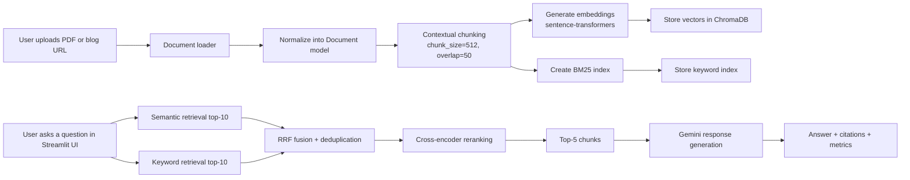
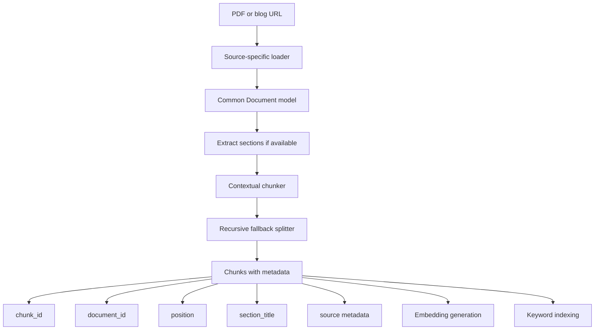
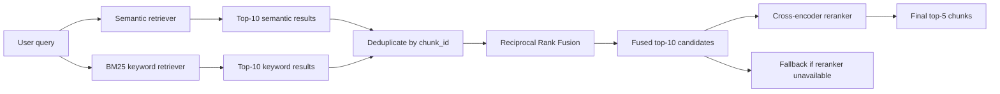
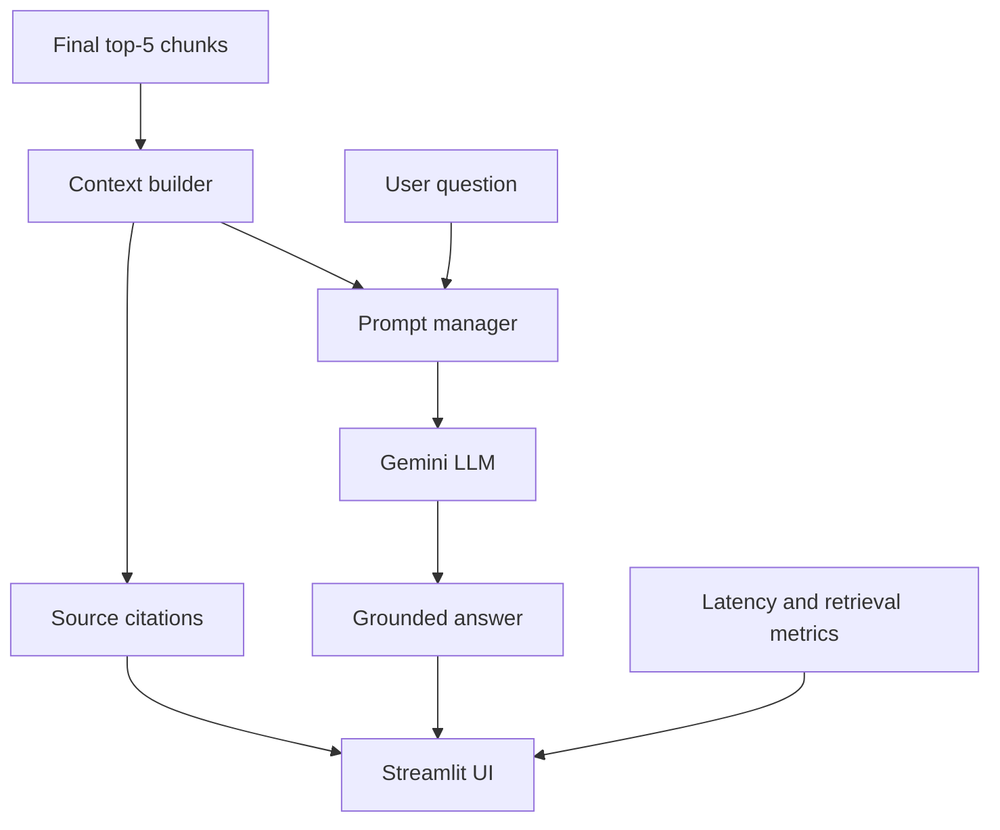

# RAG Chatbot Walkthrough Diagrams

This file groups the diagrams needed for the walkthrough video into one place.

## 1. Overall System Design

## 2. Document Ingestion And Chunking

## 3. Hybrid Search And Reranking

## 4. Final Response Generation

Use this when explaining how the final answer stays grounded in retrieved evidence.

