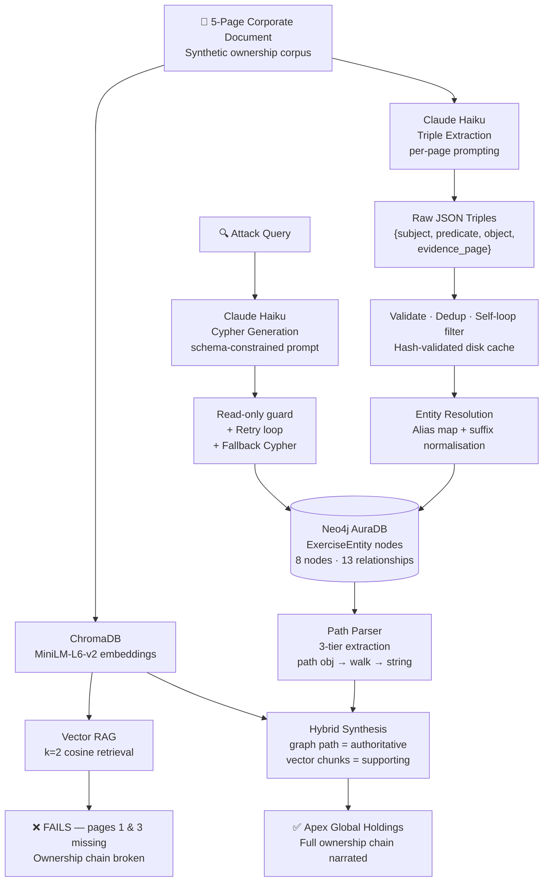
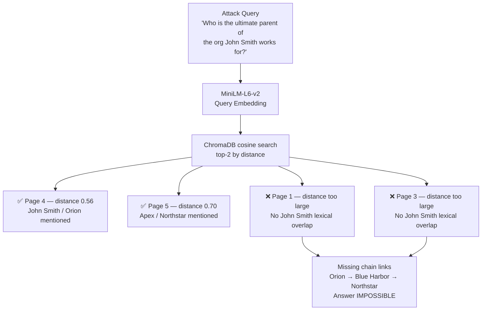
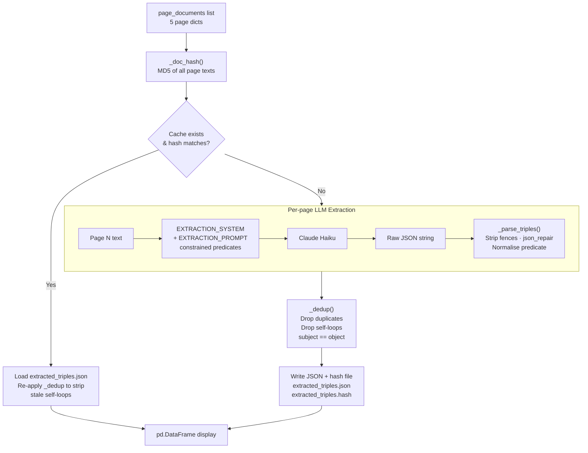
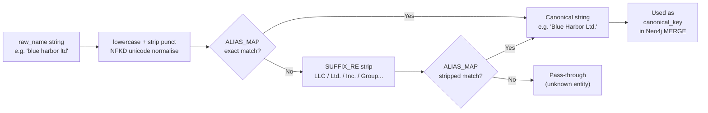
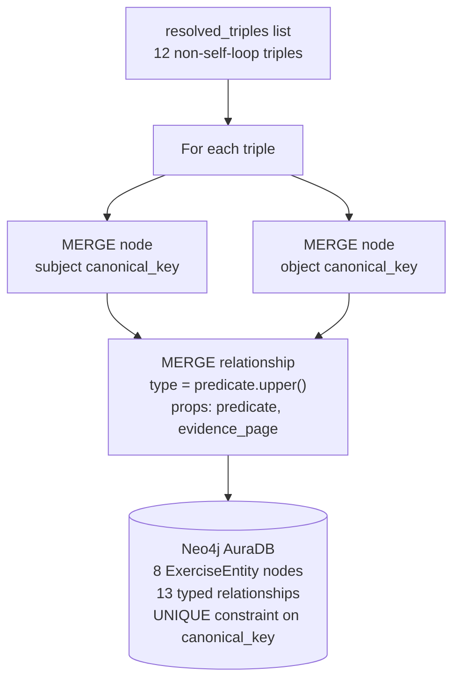
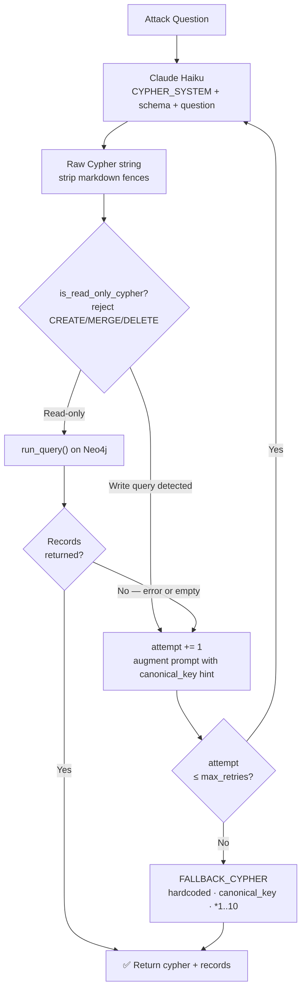
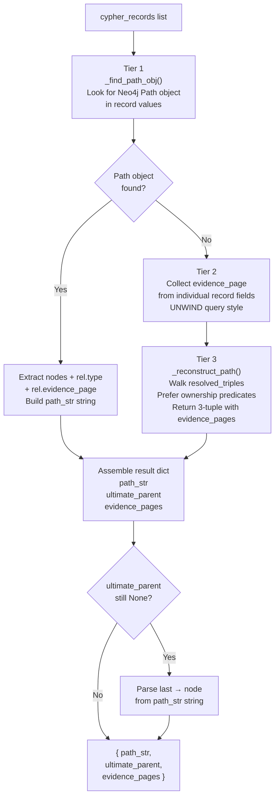
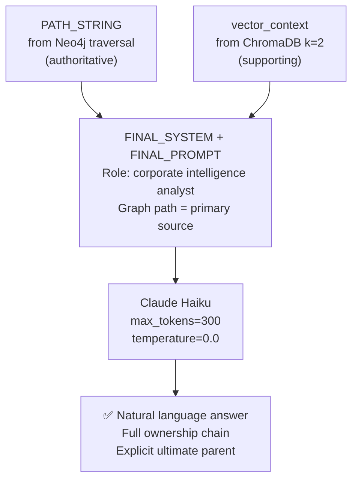
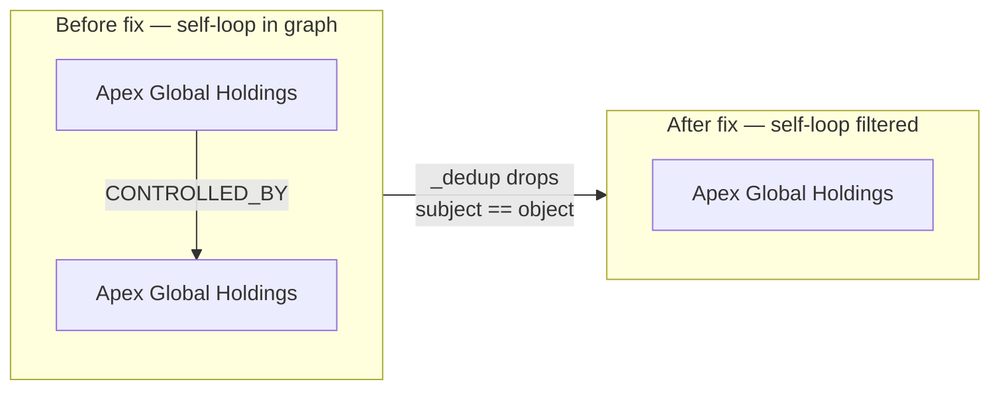
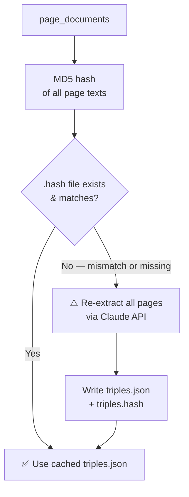

# GraphRAG: Multi-Hop Corporate Ownership Reasoning — Low-Level Design Document

---

## 1. System Architecture

The system is a **Hybrid GraphRAG pipeline** that combines semantic vector search (ChromaDB) with structured graph traversal (Neo4j) to answer multi-hop relational queries over unstructured corporate documents. An LLM (Claude Haiku) acts as the intelligence layer at three points: triple extraction, Cypher query generation, and final answer synthesis. The pipeline deliberately demonstrates where vector-only RAG fails on transitive ownership chains and how graph traversal closes that gap.

### Architecture Diagram



### Data Flow

1. **Ingest** — 5 synthetic corporate document pages are created in memory as structured dicts.
2. **Vector Index** — Pages are embedded via `all-MiniLM-L6-v2` and stored in ChromaDB; a `k=2` semantic query demonstrates retrieval failure (pages 1 and 3 missed).
3. **Triple Extraction** — Each page is sent to Claude Haiku with a structured extraction prompt; Claude returns JSON triples `{subject, predicate, object, evidence_page}`.
4. **Validation & Caching** — Triples are JSON-parsed, self-loop filtered, deduplicated, and written to a hash-validated disk cache to avoid redundant LLM calls.
5. **Entity Resolution** — Canonical names are enforced via alias map + suffix normalisation; near-duplicate entity strings collapse to a single canonical key.
6. **Graph Insertion** — Resolved triples are `MERGE`d into Neo4j as `ExerciseEntity` nodes and typed relationship edges.
7. **Cypher Generation** — The attack question is sent to Claude with the graph schema; the output is checked by a read-only guard before execution, with retry + deterministic fallback.
8. **Graph Traversal** — The validated Cypher query runs on Neo4j; the result is a relationship path from John Smith to the ultimate parent.
9. **Hybrid Answer** — The graph path (authoritative) and vector-retrieved chunks (supporting context) are combined in a final Claude prompt to produce the natural-language answer.

---

## 2. Tech Stack

| Layer | Technology / Tool | Purpose | Why Chosen |
|---|---|---|---|
| LLM | Claude Haiku (`claude-haiku-4-5-20251001`) | Triple extraction, Cypher generation, final answer | Cheapest capable Claude model; sufficient for structured output tasks |
| LLM SDK | `anthropic` Python SDK | API calls to Claude | Official SDK; clean message-based interface |
| Vector Store | ChromaDB (PersistentClient) | Semantic chunk storage and retrieval | Lightweight, no server required, supports custom embedding functions |
| Embedding Model | `sentence-transformers/all-MiniLM-L6-v2` | Text → vector embeddings | Small, fast, runs locally on CPU without GPU |
| Graph Database | Neo4j AuraDB (Free Tier) | Store and traverse entity relationship graph | Native graph traversal; Cypher query language; managed cloud instance |
| Graph Driver | `neo4j` Python driver | Execute Cypher queries from Python | Official driver; session-based query execution |
| Graph Viz | NetworkX + Matplotlib | In-notebook graph visualisation | Lightweight; Agg backend safe for Colab; no external service needed |
| Data Processing | `pandas` | Tabular display of extracted triples | Convenience only; no heavy processing required |
| JSON Repair | `json_repair` | Recover malformed LLM JSON output | Handles partial/broken JSON from Claude without hard failure |
| Cache Integrity | `hashlib` (MD5) | Hash-validated disk cache for triples | Prevents stale triple cache when source documents change |
| Runtime | Google Colab (Python 3.12) | Execution environment | No local GPU needed; free tier sufficient for this exercise |

---

## 3. Verification Pipeline — Step by Step

---

## Step 1: Vector RAG Failure Demonstration

*Purpose:*
Proves that semantic similarity alone cannot resolve multi-hop relational queries. With `k=2`, the retriever fetches the two closest pages but misses the intermediate ownership chain links (pages 1 and 3), making the question unanswerable.

*Example:*
```
Query:  "Who is the ultimate parent company of the organization John Smith works for?"
k=2 Retrieved: [Page 4 (John Smith / Orion), Page 5 (Apex / Northstar)]
Missing:        Pages 1 and 3  ← breaks the chain Orion → Blue Harbor → Northstar
```

*Key Design Decisions:*

- *Decision:* Use `k=2` deliberately (not a higher k)
  - *Options Considered:* k=2, k=3, k=5 (retrieve all pages)
  - *Why This Decision:* A higher k would hide the failure by brute-force coverage. k=2 is realistic for production systems where token cost and latency limit retrieval depth, and cleanly exposes the semantic gap that GraphRAG solves.

*Diagram*



---

## Step 2: LLM-Based Triple Extraction

*Purpose:*
Converts unstructured free-text pages into machine-readable `(subject, predicate, object)` triples that can be loaded into a graph database. Claude is prompted with a constrained predicate vocabulary to prevent schema drift. Results are cached with MD5 hash validation so re-runs skip extraction when documents are unchanged.

*Example:*
```
Input (Page 3):
  "Orion Manufacturing LLC is owned by Blue Harbor Ltd."

Output triple:
  { "subject": "Orion Manufacturing LLC",
    "predicate": "owned_by",
    "object": "Blue Harbor Ltd.",
    "evidence_page": 3 }
```

*Key Design Decisions:*

- *Decision:* Constrained predicate vocabulary in the system prompt
  - *Options Considered:* Free-form predicates, closed vocabulary, ontology-mapped predicates
  - *Why This Decision:* Free-form predicates create uncontrolled relationship types that break Cypher generation (e.g., `"is a subsidiary of"` vs `"owned_by"`). A closed list of six snake_case predicates keeps the graph schema deterministic and directly mappable to Neo4j relationship type labels.

- *Decision:* Per-page extraction (not full document)
  - *Options Considered:* Whole document in one call, page-by-page, sliding window
  - *Why This Decision:* Page-by-page extraction keeps each prompt small (reduces tokens and hallucination risk), provides a natural `evidence_page` attribution, and enables incremental caching so only failed or new pages need re-extraction.

- *Decision:* MD5 hash-validated cache (not timestamp-based)
  - *Options Considered:* Always re-extract, timestamp check, content hash check
  - *Why This Decision:* A timestamp check would not detect in-place document edits where the file mtime is unreliable (e.g., Colab re-runs). An MD5 hash of all page text content detects any change to the corpus and triggers a full re-extraction automatically, preventing silently stale triple data.

*Diagram*



---

## Step 3: Entity Resolution & Canonicalization

*Purpose:*
Prevents duplicate graph nodes for the same real-world entity expressed differently (e.g., `"Blue Harbor Ltd"` vs `"Blue Harbor Ltd."` vs `"Blue Harbor"`). Without this step, Neo4j `MERGE` would create split nodes and break traversal.

*Example:*
```
Raw extracted:  "Blue Harbor Ltd"      → canonical_key: "Blue Harbor Ltd."
Raw extracted:  "Blue Harbor Ltd."     → canonical_key: "Blue Harbor Ltd."
Raw extracted:  "Orion Manufacturing"  → canonical_key: "Orion Manufacturing LLC"
```

*Key Design Decisions:*

- *Decision:* Two-layer resolution: alias map + suffix regex
  - *Options Considered:* Exact string match only, fuzzy string matching (rapidfuzz), LLM-based entity disambiguation
  - *Why This Decision:* The entity space is small and deterministic for this exercise (8 entities). An alias map with suffix normalisation covers all observed variants without the latency or cost of fuzzy matching or an extra LLM call. Fuzzy matching would be appropriate if entity names were user-generated or highly variable in a production corpus.

*Diagram*



---

## Step 4: Neo4j Graph Insertion

*Purpose:*
Persists the resolved triples as a queryable property graph. Entities become `ExerciseEntity` nodes; predicates become typed directed relationship edges. Idempotent `MERGE` ensures re-runs don't duplicate data.

*Example:*
```cypher
MERGE (a:ExerciseEntity {canonical_key: 'Orion Manufacturing LLC'})
MERGE (b:ExerciseEntity {canonical_key: 'Blue Harbor Ltd.'})
MERGE (a)-[r:OWNED_BY]->(b)
  ON CREATE SET r.predicate = 'owned_by', r.evidence_page = 3
```

*Key Design Decisions:*

- *Decision:* `canonical_key` as the uniqueness constraint property (not `name`)
  - *Options Considered:* Use `name` as unique key, use auto-generated UUID, use `canonical_key`
  - *Why This Decision:* `name` may vary across triple extractions (e.g., trailing dot differences). Using the normalised `canonical_key` from entity resolution as the constraint property guarantees that the same real-world entity is always found by `MERGE`, regardless of minor surface-form variation in the source text.

- *Decision:* Predicate string → `UPPER_CASE` relationship type label
  - *Options Considered:* Keep snake_case, convert to UPPER_CASE, use a generic `RELATED_TO` with a property
  - *Why This Decision:* Neo4j relationship types are conventionally UPPER_CASE and are directly usable in Cypher pattern matching (`-[:OWNED_BY]->`). A generic label would require property filtering, making LLM-generated Cypher queries more verbose and error-prone.

*Diagram*



---

## Step 5: Cypher Query Generation & Retry Logic

*Purpose:*
Translates the natural-language attack question into an executable Neo4j Cypher traversal query. Rejects write queries via a read-only guard before execution. Handles LLM schema hallucination via a retry loop and a deterministic fallback query.

*Example:*
```
Input question: "Who is the ultimate parent company of the organization John Smith works for?"

Generated Cypher (attempt 1):
  MATCH (p:ExerciseEntity {name:"John Smith"})-[:WORKS_FOR]->
        (org)-[:OWNED_BY|CONTROLLED_BY|PARENT_COMPANY_OF*1..10]->(parent)
  WHERE NOT (parent)-[:OWNED_BY|CONTROLLED_BY|PARENT_COMPANY_OF]->()
  RETURN path, parent.name AS ultimate_parent

Fallback Cypher (on retry exhaustion):
  MATCH path = (:ExerciseEntity {canonical_key: 'John Smith'})
        -[:WORKS_FOR|EXECUTIVE_OF|OWNED_BY|CONTROLLED_BY|PARENT_COMPANY_OF*1..10]->
        (parent:ExerciseEntity)
  RETURN path, parent.name AS ultimate_parent
  ORDER BY length(path) DESC LIMIT 1
```

*Key Design Decisions:*

- *Decision:* Read-only Cypher guard (`is_read_only_cypher`)
  - *Options Considered:* No guard (trust LLM), allowlist of safe keywords, regex reject of write keywords
  - *Why This Decision:* A write query generated by a misaligned LLM response (`CREATE`, `MERGE`, `DELETE`) would silently corrupt or destroy the graph. A regex reject on write keywords is simple, fast, and catches the common cases without needing a full Cypher parser. Rejected queries increment the retry counter so Claude gets another attempt.

- *Decision:* Schema-constrained Cypher generation prompt
  - *Options Considered:* No schema (free generation), full schema injection, minimal schema with allowed labels/rels only
  - *Why This Decision:* Without schema constraints, Claude will hallucinate relationship types or node labels that don't exist in the graph. Injecting only the allowed labels and relationship names keeps the generation space small and predictable, matching the actual Neo4j schema.

- *Decision:* Deterministic hardcoded fallback query
  - *Options Considered:* Fail on retry exhaustion, ask user to rephrase, hardcoded fallback
  - *Why This Decision:* The fallback uses `canonical_key` (proven to match) and a union of all traversal relationship types with variable-length path `*1..10`, making it robust to any reasonable ownership depth. Since the exercise has a known correct answer, a deterministic fallback ensures the pipeline always produces a result.

*Diagram*



---

## Step 6: Graph Path Retrieval & Parsing

*Purpose:*
Extracts a human-readable ownership chain string, the ultimate parent entity name, and source evidence page numbers from the raw Neo4j query result. Handles multiple result formats via a three-tier extraction strategy.

*Example:*
```
Neo4j Path object → parsed to:
"John Smith -[WORKS_FOR]-> Orion Manufacturing LLC
           -[CONTROLLED_BY]-> Blue Harbor Ltd.
           -[CONTROLLED_BY]-> Northstar Capital Group
           -[OWNED_BY]-> Apex Global Holdings"

ultimate_parent  = "Apex Global Holdings"
evidence_pages   = [4, 3, 2, 5]
```

*Key Design Decisions:*

- *Decision:* Three-tier path extraction (Neo4j path object → UNWIND record fields → in-memory graph walk)
  - *Options Considered:* Depend solely on Neo4j path object, parse only string fields, always reconstruct from `resolved_triples`
  - *Why This Decision:* Different Cypher queries return the path in different shapes — the primary query returns a Neo4j Path object, UNWIND-style queries return individual property fields, and the fallback path object may fail to parse if the driver version differs. The three-tier fallback ensures robustness without requiring the query to always return the same structure.

- *Decision:* `_reconstruct_path` returns a 3-tuple `(path_str, end_node, evidence_pages)`
  - *Options Considered:* 2-tuple without evidence pages, 3-tuple, separate function for evidence collection
  - *Why This Decision:* The fallback graph walk was previously losing evidence page provenance (`Evidence pages: []`). Collecting `evidence_page` from each traversed triple during the walk and returning it as a third element keeps provenance intact regardless of which extraction tier succeeds.

*Diagram*



---

## Step 7: Hybrid GraphRAG Final Answer

*Purpose:*
Combines the precise graph-derived ownership chain with the semantically retrieved vector context to generate a grounded, explainable natural-language answer. The graph path is treated as authoritative; vector context provides supporting narrative.

*Example:*
```
Graph path (authoritative):
  John Smith → Orion Manufacturing LLC → Blue Harbor Ltd.
  → Northstar Capital Group → Apex Global Holdings

Vector context (supporting):
  Page 4: "John Smith is the CFO of Orion Manufacturing LLC"
  Page 5: "Northstar Capital Group is wholly owned by Apex Global Holdings"

Final Answer:
  "John Smith works for Orion Manufacturing LLC, which is controlled by
   Blue Harbor Ltd., which is controlled by Northstar Capital Group,
   which is owned by Apex Global Holdings. The ultimate parent company
   is Apex Global Holdings."
```

*Key Design Decisions:*

- *Decision:* Graph path marked as authoritative; vector context marked as supporting
  - *Options Considered:* Equal weight to both, vector context primary, graph path only (no vector context)
  - *Why This Decision:* The graph path is derived from structured traversal and is logically correct. Vector context adds readable background but may be incomplete (it only contains `k=2` chunks). Explicitly marking the hierarchy in the prompt prevents Claude from contradicting the graph with a semantically plausible but factually wrong answer from the vector context alone.

*Diagram*



---

## 4. Core Components

---

## Document Layer

### SyntheticDocumentStore
- *Responsibility:* Holds the 5 in-memory page dicts that simulate a real corporate document corpus.
- *Input:* None (hardcoded `PAGES` dict)
- *Output:* `page_documents` list `[{page_number: int, text: str}]`
- *Notes:* Relationships are deliberately spread across non-adjacent pages to force multi-hop reasoning; `full_document_text` is also assembled for reference.

---

## Vector Search Layer

### ChromaDB Collection (`corporate_docs`)
- *Responsibility:* Store page embeddings and serve semantic similarity queries.
- *Input:* Page texts + SentenceTransformer embeddings
- *Output:* Top-k documents + distances for a query string
- *Notes:* PersistentClient stores to `/content/chroma_corporate_rag`; collection is deleted and recreated on each run to avoid stale data.

### SentenceTransformer Embedding Function
- *Responsibility:* Convert text strings to dense vectors for ChromaDB.
- *Input:* Raw text string
- *Output:* 384-dimensional float vector
- *Notes:* `all-MiniLM-L6-v2`; runs locally on CPU; no HF token required for public model.

---

## LLM Interaction Layer

### `call_claude(prompt, system, max_tokens, temperature)`
- *Responsibility:* Unified wrapper for all Claude API calls; handles model selection and error catching.
- *Input:* Prompt string, optional system string, token/temperature params
- *Output:* Raw response text string
- *Notes:* Uses `temperature=0.0` by default for deterministic structured output; raises `RuntimeError` wrapping `anthropic.APIError`.

### Extraction Prompt (`EXTRACTION_SYSTEM` + `EXTRACTION_PROMPT_TEMPLATE`)
- *Responsibility:* Instruct Claude to extract relational triples from a single page with a constrained predicate set.
- *Input:* Page number + page text
- *Output:* JSON array string of triples
- *Notes:* System prompt lists six allowed snake_case predicates; output format is JSON-only (no markdown fences expected).

### Cypher Generation Prompt (`CYPHER_SYSTEM` + `CYPHER_PROMPT_TEMPLATE`)
- *Responsibility:* Translate a natural-language question into a read-only Neo4j Cypher query.
- *Input:* Graph schema string + question string
- *Output:* Cypher query string
- *Notes:* System prompt requires: read-only only, `path` variable name, `RETURN path, parent.name AS ultimate_parent` clause.

---

## Knowledge Graph Layer

### Neo4j AuraDB Instance
- *Responsibility:* Persist and traverse the entity relationship graph.
- *Input:* MERGE Cypher statements for nodes and relationships
- *Output:* Query results (path objects, property maps)
- *Notes:* Free tier; uniqueness constraint on `:ExerciseEntity(canonical_key)`; cleaned and rebuilt on each notebook run.

### `run_query(cypher, params)`
- *Responsibility:* Execute any Cypher query on the configured Neo4j database.
- *Input:* Cypher string + optional params dict
- *Output:* List of `record.data()` dicts
- *Notes:* Session is opened and closed per call; not connection-pooled; no retry on transient errors.

### `insert_graph(triples)`
- *Responsibility:* Idempotently insert all resolved triples as nodes + typed relationships.
- *Input:* Resolved triples list
- *Output:* Side effect: Neo4j nodes and relationships created/merged
- *Notes:* Predicate is uppercased to Neo4j relationship type; uses `MERGE` to avoid duplicates across re-runs.

---

## Entity Resolution Layer

### `canonical_key(name)` + `ALIAS_MAP`
- *Responsibility:* Normalise any entity name string to its canonical form for consistent Neo4j node lookup.
- *Input:* Raw entity name string (e.g., `"Blue Harbor Ltd"`)
- *Output:* Canonical string (e.g., `"Blue Harbor Ltd."`)
- *Notes:* Two-pass: exact alias lookup, then suffix-stripped alias lookup via `SUFFIX_RE`. Handles all 8 entities in the exercise corpus.

### Triple Deduplication + Self-Loop Filter (`_dedup`)
- *Responsibility:* Remove duplicate `(subject, predicate, object)` tuples and self-referential triples before graph insertion.
- *Input:* Raw triples list (may include cross-page duplicates and self-loops from LLM hallucination)
- *Output:* Deduplicated, self-loop-free triples list
- *Notes:* Drops triples where `subject.lower() == object.lower()` before dedup keying; also re-applied on cache load to strip stale self-loops from old cache files.

### Hash-Validated Cache (`_doc_hash`, `CACHE_PATH`, `HASH_PATH`)
- *Responsibility:* Persist extracted triples to disk and invalidate the cache automatically when document content changes.
- *Input:* MD5 hash of concatenated page texts
- *Output:* Valid cache (`.json`) + hash file (`.hash`); or triggers re-extraction if hash mismatch
- *Notes:* Both files must exist and hash must match for cache to be trusted; written atomically after extraction completes.

---

## Path Retrieval Layer

### `parse_path(records)`
- *Responsibility:* Extract a readable path string, ultimate parent entity name, and evidence pages from Neo4j query results.
- *Input:* List of Cypher result record dicts
- *Output:* `{path_str, ultimate_parent, evidence_pages}`
- *Notes:* Three-tier extraction: Neo4j path object → UNWIND record field scan → `_reconstruct_path` in-memory walk. Robust to varying Cypher return shapes.

### `_reconstruct_path(start)` → `(path_str, end_node, evidence_pages)`
- *Responsibility:* Walk `resolved_triples` in memory to build a traversal chain when the Neo4j path object is unavailable.
- *Input:* Start entity name string (default `"John Smith"`)
- *Output:* 3-tuple: `(path_string, end_node_name, evidence_pages_list)`
- *Notes:* Ownership predicates (`owned_by`, `controlled_by`, `parent_company_of`) overwrite other edges for a given subject so the chain follows ownership, not employment. Evidence page is collected at each hop.

### `run_cypher_with_retry(question, schema, max_retries=2)`
- *Responsibility:* Attempt Claude-generated Cypher up to `max_retries` times, falling back to `FALLBACK_CYPHER` on exhaustion.
- *Input:* Question string, schema string
- *Output:* `(final_cypher_string, records_list)` tuple
- *Notes:* Write queries are rejected by `is_read_only_cypher()` and count as a failed attempt. Each retry augments the prompt with a `canonical_key` correction hint.

### `is_read_only_cypher(cypher)` + `_WRITE_KEYWORDS`
- *Responsibility:* Reject any LLM-generated Cypher that contains write operations before it reaches the database.
- *Input:* Cypher string
- *Output:* `bool` — `True` if safe to execute
- *Notes:* Regex checks for `CREATE`, `MERGE`, `DELETE`, `DETACH DELETE`, `SET`, `REMOVE`, `DROP`, `CALL apoc.`. Case-insensitive match.

---

## Visualization Layer

### NetworkX + Matplotlib Graph (`/content/graph_visualization.png`)
- *Responsibility:* Render the in-memory knowledge graph as a directed node-edge diagram.
- *Input:* `resolved_triples` list
- *Output:* PNG file saved to `/content/graph_visualization.png`
- *Notes:* Spring layout with `seed=42` for reproducibility; edge labels show predicate names; uses `Agg` backend (non-interactive, safe for Colab).

---

## 5. Known Issues & Mitigations

The following issues were identified and addressed in Section 15 of the notebook.

| # | Issue | Status | Fix Location |
|---|---|---|---|
| 1 | Self-loop triples (e.g., `Apex → controlled_by → Apex`) inflate path length | ✅ Fixed | `_dedup()` in Section 6 |
| 2 | Stale cache reused after document edits | ✅ Fixed | MD5 `_doc_hash()` + `.hash` file in Section 6 |
| 3 | Evidence pages always empty when fallback path used | ✅ Fixed | `_reconstruct_path()` 3-tuple in Section 12 |
| 4 | No read-only guard on LLM-generated Cypher | ✅ Fixed | `is_read_only_cypher()` in Section 11 |
| 5 | Path cycle from self-loop in Neo4j (symptom of Issue 1) | ✅ Fixed | Resolved by Issue 1 fix |
| 6 | Entity resolution relies on manually maintained alias map | ⚠️ Partial | Suffix regex handles common variants; unknown aliases still create duplicate nodes |
| 7 | LLM may hallucinate non-existent predicates or reverse edge direction | ⚠️ Partial | Predicate allowlist enforced; direction validation not implemented |
| 8 | No timeout on Anthropic API or Neo4j calls | ⚠️ Not implemented | Production fix: `httpx` timeout in SDK, `connection_timeout` in Neo4j driver |
| 9 | No reconnection logic for transient Neo4j `ServiceUnavailable` errors | ⚠️ Not implemented | Production fix: retry-with-backoff wrapper around `run_query()` |

### Issue Detail: Self-Loop Triples (Issue 1)



### Issue Detail: Hash-Validated Cache (Issue 2)


