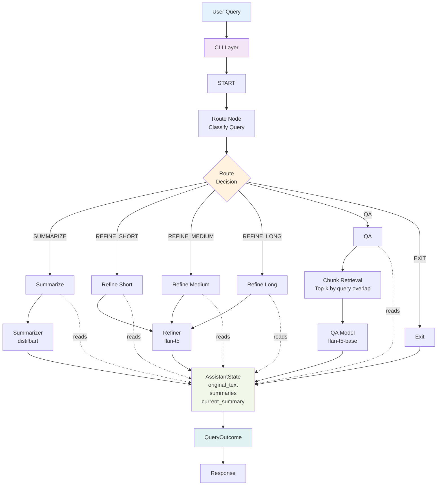
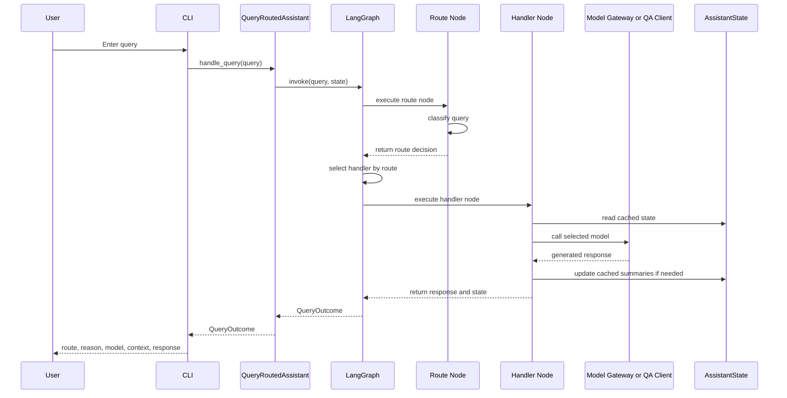

# Exercise 3 Low Level Design

## 1. Purpose

This implementation is a query-routed multi-model assistant built for Exercise 3. The user provides one large text document, and the application routes each query to the correct model role:

- summarization model
- refinement model
- QA model

The system is stateful, so summaries generated in earlier turns are reused in later turns.

## 2. Implemented Architecture

### High-level components

1. CLI Layer
   - accepts document input
   - validates missing files, non-file paths, and empty documents before model execution
   - starts the interactive loop
   - converts runtime failures into user-facing error messages
   - prints route, reason, model used, context source, and response
2. Router
   - classifies the user query into `SUMMARIZE`, `REFINE_SHORT`, `REFINE_MEDIUM`, `REFINE_LONG`, `QA`, or `EXIT`
3. Orchestrator
   - built with LangGraph
   - invokes exactly one handler node per query
4. State Store
   - holds the original text and cached summaries
   - builds QA context with query-aware chunk retrieval for large documents
5. Model Gateway / Clients
   - Hugging Face summarization model
   - Hugging Face refinement model
   - Hugging Face QA model

## 3. Architecture Diagram



## 4. Code Structure

```text
exercise3/
|-- assistant.py
|-- requirements.txt
|-- sample_input.txt
|-- docs/
|   |-- README.md
|   |-- implementation_plan.md
|   |-- remaining_steps.md
|   `-- LOW_LEVEL_DESIGN.md
|-- tests/
|   |-- test_cli.py
|   |-- test_orchestrator.py
|   |-- test_pipeline.py
|   |-- test_qa.py
|   |-- test_router.py
|   |-- test_state.py
|   `-- test_text_processing.py
`-- tri_model_assistant/
    |-- __init__.py
    |-- core/
    |   |-- __init__.py
    |   |-- config.py
    |   |-- orchestrator.py
    |   |-- router.py
    |   `-- state.py
    |-- interface/
    |   |-- __init__.py
    |   `-- cli.py
    |-- models/
    |   |-- __init__.py
    |   |-- pipeline.py
    |   `-- qa.py
    `-- processing/
        |-- __init__.py
        `-- text_processing.py
```

## 5. Module Responsibilities

### [assistant.py](../assistant.py)

Thin entrypoint that starts the CLI.

### [tri_model_assistant/interface/cli.py](../tri_model_assistant/interface/cli.py)

- loads input text
- validates that file input exists, is a file, and is non-empty
- creates application objects
- runs the query loop
- catches query-time runtime failures and reports them cleanly
- prints final output to the terminal

### [tri_model_assistant/core/config.py](../tri_model_assistant/core/config.py)

- stores model ids and generation settings
- supports environment-variable overrides
- includes QA retrieval controls:
   - `EX3_QA_CHUNK_WORD_LIMIT`
   - `EX3_QA_CHUNK_OVERLAP_PARAGRAPHS`
   - `EX3_QA_MAX_CHUNKS`

### [tri_model_assistant/core/router.py](../tri_model_assistant/core/router.py)

- performs rule-based query classification
- returns the route and routing reason

### [tri_model_assistant/core/state.py](../tri_model_assistant/core/state.py)

Stores:

- `original_text`
- `draft_summary`
- `short_summary`
- `medium_summary`
- `long_summary`
- `current_summary`
- retrieval-aware QA context built from top-ranked original-document chunks

### [tri_model_assistant/core/orchestrator.py](../tri_model_assistant/core/orchestrator.py)

- defines the LangGraph workflow
- executes the route-specific node
- enforces refinement output ordering (short < medium < long) with extractive fallback
- returns the final `QueryOutcome`

### [tri_model_assistant/models/pipeline.py](../tri_model_assistant/models/pipeline.py)

- chunking-based summarization
- summary refinement by selected length
- loads Hugging Face seq2seq models
- wraps model load and generation failures in clear runtime errors
- exposes QA chunking configuration to orchestrator (`qa_chunk_word_limit`, `qa_chunk_overlap_paragraphs`, `qa_max_chunks`)

### [tri_model_assistant/models/qa.py](../tri_model_assistant/models/qa.py)

- loads the Hugging Face QA model
- applies grounded-answer guardrails
- refuses unrelated questions
- falls back to stored summary if the QA model over-refuses broad document questions
- wraps QA model load and inference failures in clear runtime errors

### [tri_model_assistant/processing/text_processing.py](../tri_model_assistant/processing/text_processing.py)

- text normalization
- paragraph splitting
- chunk creation
- refinement prompt construction
- summary-length coercion and extractive fallback helpers

## 6. Request Flow

### End-to-end sequence



### WorkflowState and state updates

The LangGraph workflow uses `WorkflowState` to manage information flow:

- Input: `assistant_state`, `query`
- After route node: `route`, `route_reason`
- After handler node: `response`, `context_source`, `model_used`
- Output: all fields assembled into `QueryOutcome`

## 7. Route Behavior

### `SUMMARIZE`

- if `draft_summary` does not exist, generate it from the original document
- return the draft summary

### `REFINE_SHORT | REFINE_MEDIUM | REFINE_LONG`

- ensure `draft_summary` exists
- refine it to the requested length
- cache the result
- update `current_summary`

### `QA`

- build QA context using query-aware chunk retrieval from the original document
   - split the original text into QA chunks
   - score chunks by token overlap with the user query
   - select top-k chunks (fallback to first chunks if overlap is weak)
   - append current summary if available, otherwise draft summary
- run the QA model on that grounded context
- refuse out-of-scope prompts
- if the model wrongly says context is insufficient for a broad document question, return a grounded fallback summary

### `EXIT`

- stop the application loop

## 8. Model Mapping

| Role          | Default Model                     | Usage                                         |
| ------------- | --------------------------------- | --------------------------------------------- |
| Summarization | `sshleifer/distilbart-cnn-12-6` | Generate draft summary from chunked document  |
| Refinement    | `google/flan-t5-small`          | Rewrite summary by requested length           |
| QA            | `google/flan-t5-base`           | Answer grounded questions from retrieved chunks + stored summaries |

## 9. LangGraph Multi-Model Routing Implementation

The `QueryRoutedAssistant` uses LangGraph to implement a stateful, multi-model routing workflow:

### Graph structure

1. Entry: `START` -> `route` node
2. Route node:
   - calls `QueryRouter.route(query)` to classify the query
   - returns `route` and `route_reason` in workflow state
3. Conditional routing:
   - `Route.SUMMARIZE` -> `summarize`
   - `Route.REFINE_SHORT` -> `refine_short`
   - `Route.REFINE_MEDIUM` -> `refine_medium`
   - `Route.REFINE_LONG` -> `refine_long`
   - `Route.QA` -> `qa`
   - `Route.EXIT` -> `exit`
4. Handler nodes:
   - `_summarize_node()` uses `TriModelModelGateway.generate_draft_summary()`
   - `_refine_short_node()` uses `TriModelModelGateway.refine_summary(SummaryLength.SHORT)`
   - `_refine_medium_node()` uses `TriModelModelGateway.refine_summary(SummaryLength.MEDIUM)`
   - `_refine_long_node()` uses `TriModelModelGateway.refine_summary(SummaryLength.LONG)`
   - `_qa_node()` uses `HuggingFaceQAClient.answer_question()`
   - `_exit_node()` returns a static exit message
5. Exit: all handler nodes connect to `END`

### State management

- `AssistantState` persists across graph invocations
- `WorkflowState` carries the current query, route decision, response metadata, and shared state

### Multi-model coordination

1. Summarizer runs on first summarization request -> caches draft
2. Refiner runs multiple times on the same draft -> caches short, medium, and long variants
3. QA uses a distinct checkpoint from the refiner and consumes retrieved original-document chunks plus current summary (or draft)

## 10. Validation Implemented

The codebase includes tests for:

- text chunking and prompt generation
- router classification
- CLI input validation and query-time runtime failure handling
- orchestrator state transitions
- refinement output band enforcement and repetitive-output fallback behavior
- QA guardrails and fallback behavior
- state-level retrieval chunk selection and QA context source labeling

Current validation entry points:

- `python -m unittest discover -s tests`
- CLI interactive run with `sample_input.txt`

## 11. Current Design Strengths

- clear separation of routing, orchestration, state, and model logic
- cached summaries reduce repeated work
- query handling is deterministic and easy to explain
- QA path is grounded and guarded against unrelated requests
- all three model roles now run directly from Hugging Face
- LangGraph provides explicit workflow control and state traceability
